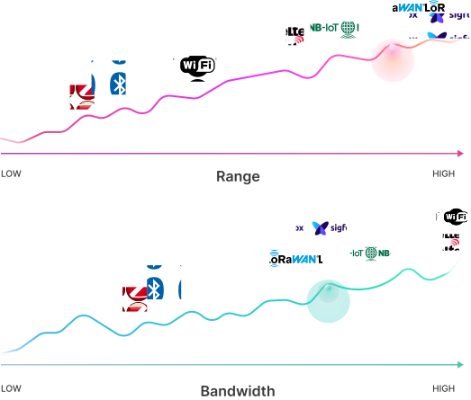

## How does LoRa Work ? 🤔

**Like How Dolphins Communicate**

Think of **LoRa as a special way** for electronic devices to “talk” to each other—kind of **like how dolphins** or bats use sound to communicate over **long distances.**

#### Chirp Communication, Just Like Dolphins

Dolphins send out **chirp pulses—short,** sharp sounds that spread through water and help them communicate even in noisy, obstacle-filled environments. LoRa uses a very similar technique called **Chirp Spread Spectrum (CSS).** Instead of sound, it sends out radio signals that change in frequency (a “chirp”) as they travel.

This method makes **LoRa highly resilient** even if there’s interference (like buildings, walls, or other signals), the chirps can still cut through and reach their destination.

#### Impressive Range

Just as a dolphin’s chirp can travel miles underwater, **LoRa signals can reach up to 15 km in open rural areas,** and still cover several kilometers in dense cities. This is perfect for sensors that send small bits of data—like temperature readings or alerts—but need to stay connected over long distances.

#### License-Free Communication

LoRa operates in sub-gigahertz license-free bands like: 
- 433 MHz (China)
- 868 MHz (Europe)
- 865 MHz (India)

These are part of the ISM (Industrial, Scientific, Medical) radio bands. That means devices can use these frequencies without needing to buy a license—like using a public road instead of a toll road.

#### Flexible Frequencies

While LoRa typically uses the lower frequencies (433/868/915 MHz) for long-range, low-power communication, it can also work at 2.4 GHz. This higher frequency allows faster data rates, but with shorter range—just like dolphins might chirp more rapidly when nearby but switch to slower, louder calls for long-distance communication.

#### LoRa In Summary

- LoRa = Dolphin-like communication using chirps over radio waves.
- Resilient even in noisy environments.
- Long-range (up to 15 km) + low power = perfect for IoT sensors.
- No license needed (uses free ISM bands).
- Switches frequencies based on range vs. speed needs.

## How does LoRaWAN Work ? 🧐

**The Traffic Controller for Device Conversations**

Think of LoRaWAN as the **smart traffic controller** that manages communication in a busy city filled with cars (devices). While LoRa is the physical way messages travel—like the roads—LoRaWAN is the system of rules that controls when each device can “drive,” which lane (frequency) it should use, and how to avoid crashes (signal collisions)

#### Coordinated Communication

In a network with hundreds or even **millions of sensors** like water meters, temperature loggers, or air quality monitors—everyone wants to send their data. If they all tried to transmit at the same time, it would be chaos.

LoRaWAN solves this by:

- **Scheduling when devices should talk** 

- **Assigning channels (frequencies) to avoid interference** 

- **Making sure data gets delivered securely and reliably** 

- **Handling acknowledgements (like saying “message received”)** 

Just like a traffic controller keeps cars from colliding at an intersection, **LoRaWAN** ensures that your IoT devices don’t interfere with each other and that every **message gets through safely.**

#### Built-in Security

LoRaWAN also acts like the security **gate—it** uses **AES-128 encryption** to make sure no one else can snoop or tamper with the messages. Each device has its own identity and secure keys to ensure authenticity and confidentiality.

#### Low Power, Long Life

Thanks to LoRaWAN’s efficiency, devices can sleep most of the time and only wake up briefly to send or receive data. This traffic controller ensures that even battery-powered devices can last for years without charging.

#### LoRaWAN - In Summary
- LoRa = The road (how data travels)
- LoRaWAN = The traffic rules + controller (when, how, and what is sent)
- Prevents data collisions, ensures secure and efficient communication
- Perfect for managing large networks of low-power IoT devices

### LoRaWAN Specification Versions

<table className="parameter-table">
  <thead>
    <tr>
      <th>Version</th>
      <th>Release Date</th>
    </tr>
  </thead>
  <tbody>
    <tr><td>1.0</td><td>January 2015</td></tr>
    <tr><td>1.0.1</td><td>February 2016</td></tr>
    <tr><td>1.0.2</td><td>July 2016</td></tr>
    <tr><td>1.1</td><td>October 2017</td></tr>
    <tr><td>1.0.3</td><td>July 2018</td></tr>
    <tr><td>1.0.4</td><td>October 2020</td></tr>
  </tbody>
</table>

## Bandwidth vs. Range in LoRa and LoRaWAN

Imagine you’re at a crowded party and want to send a message to a friend across the room. If you whisper, only those nearby will hear you clearly—but your message won’t reach far. This is similar to using a high data rate in wireless communication: the data is transmitted clearly and quickly, but only over short distances.

Now, if you shout, your voice can travel across the entire room. But the message may become less clear, and it takes longer to get it across. This is like using a lower data rate with LoRa technology—your data can travel farther, but the transmission is slower and less efficient.

 

#### How LoRa Balances Bandwidth and Range

LoRa (Long Range) technology works the same way. When a device needs to send a signal over a long distance—such as a sensor in a remote farm field—it uses low bandwidth and a higher spreading factor. This is the “shouting” mode: it **extends communication range,** but **reduces data speed.**

On the flip side, when LoRa devices are **close together, they can “whisper”** using h**igher bandwidth and lower spreading factors.** This allows them to transmit data quickly, but over shorter distances.

#### The LoRaWAN Trade-Off

LoRaWAN, the communication protocol that runs on top of LoRa, smartly manages this trade-off. It allows devices to choose between range and data rate based on their needs and position in the network.

- **Lower bandwidth** = Longer range, Slower speed
- **Higher bandwidth** = Shorter range, Faster transmission

This makes LoRaWAN ideal for IoT sensor networks, where small packets of data—like temperature, humidity, or motion—need to be sent over long distances without draining battery life.

#### Key Takeaway

In LoRaWAN communication, lower bandwidth increases range but slows transmission, while higher bandwidth shortens range but boosts speed—just like choosing between whispering or shouting in a noisy room.

## Superpowers of Devices

  

    <strong>Ultra Low Power</strong>
    LoRaWAN devices are optimized to use as little energy as possible, enabling them to operate for years on a single battery—ideal for remote or hard-to-reach deployments.
  

  

    <strong>Long Range</strong>
    A single LoRaWAN gateway can communicate with devices 10–15 kilometers away in rural areas, and 3–5 kilometers even in dense urban environments with high interference.
  

  

    <strong>Deep Indoor Penetration</strong>
    LoRaWAN excels at penetrating walls and floors, keeping devices connected even in basements, warehouses, and multi-story buildings where other signals fail.
  

  

    <strong>License-Free Spectrum</strong>
    LoRaWAN operates on globally available license-free ISM bands (868 MHz in Europe, 915 MHz in the US), offering free and reliable wireless communication without licensing costs.
  

  

    <strong>Geolocation Without GPS</strong>
    LoRaWAN enables location tracking through triangulation between gateways—no GPS module required—saving both battery life and hardware cost.
  

  

    <strong>High Capacity</strong>
    A single LoRaWAN gateway can manage data from thousands of devices, making it scalable for smart cities, industrial automation, and wide-scale sensor networks.
  

  

    <strong>End-to-End Security</strong>
    Every message is encrypted with AES-128, ensuring secure communication. Only the sender and the receiving server can access the data, protecting privacy and integrity.
  

  

    <strong>Robust Ecosystem</strong>
    LoRaWAN-certified devices adhere to strict standards, ensuring interoperability, reliability, and seamless integration across global networks.
  

## Where you can use these devices ?

  

    <strong>Vaccine Cold Chain Monitoring 💉</strong>
    Sensors monitor temperature during vaccine transportation.
  

  

    <strong>Wildlife Conservation 🦏</strong>
    Tracking devices help monitor endangered species like Black Rhinos and Amur Leopards.
  

  

    <strong>Elder Care 👵</strong>
    Wearable devices track falls and medication schedules for dementia patients.
  

  

    <strong>Smart Agriculture 🌾 </strong>
    Soil moisture sensors enable optimized irrigation, reducing water usage by up to 30%.
  

  

    <strong>Water System Monitoring 💧</strong>
    LoRaWAN helps detect leaks in municipal water networks for faster repairs.
  

  

    <strong>Smart Waste Management 🗑️ </strong>
    Sensors in waste bins optimize collection schedules based on fill levels.
  

  

    <strong>Bike Tracking 🚲</strong>
    Devices track bicycles in remote and urban areas.
  

  

    <strong>Airport Operations ✈️</strong>
    LoRaWAN boasts a vast ecosystem of manufacturers, service providers, and developers.
  

  

    <strong>Office Efficiency 🏢</strong>
    LoRaWAN monitors room occupancy, energy use, and parking space availability.
  

## What is the LoRa Alliance?

The **LoRa Alliance®** is the official global association that oversees the ongoing development and adoption of the **LoRaWAN® protocol**, one of the most widely adopted **LPWAN (Low Power Wide Area Network)** technologies for the Internet of Things (IoT). 

#### Who Are They?

Formed in **2015**, the **LoRa Alliance** is a **non-profit organization** composed of leading tech companies, manufacturers, network operators, and developers. They work together to ensure that LoRaWAN-enabled devices and networks remain **interoperable**, **scalable**, and **secure** worldwide.

#### What Do They Do?

- 🛠️ Define and continuously update **LoRaWAN specifications**
- ✅ Ensure **global device interoperability** through standardization
- 🔐 Operate a **certification program** to verify that devices with the **LoRaWAN® logo** meet high standards of **performance**, **security**, and **compliance**

#### Why It Matters

Thanks to the efforts of the LoRa Alliance, organizations across industries—from smart agriculture and healthcare to smart cities—can confidently **build, deploy, and scale** reliable LoRaWAN-based IoT solutions with guaranteed compatibility and longevity.

## Technical Abbreviations

<table className="parameter-table">
  <thead>
    <tr>
      <th>Term</th>
      <th>Definition</th>
    </tr>
  </thead>
  <tbody>
    <tr><td>LoRa</td><td>Long Range</td></tr>
    <tr><td>LoRaWAN</td><td>Long Range Wide Area Network</td></tr>
    <tr><td>LNS</td><td>LoRa Network Server</td></tr>
    <tr><td>AES</td><td>Advanced Encryption Standard</td></tr>
    <tr><td>DR</td><td>Data Rate</td></tr>
    <tr><td>WOR</td><td>Wake On Radio</td></tr>
    <tr><td>ACK</td><td>Acknowledgement</td></tr>
    <tr><td>WorSIntKey</td><td>WOR Integrity Session Key</td></tr>
    <tr><td>WorSEncKey</td><td>WOR Encryption Session Key</td></tr>
    <tr><td>MAC</td><td>Media Access Control</td></tr>
    <tr><td>MIC</td><td>Message Integrity Code</td></tr>
    <tr><td>OTAA</td><td>Over The Air Activation</td></tr>
    <tr><td>ABP</td><td>Activation By Personalization</td></tr>
    <tr><td>SF</td><td>Spreading Factor</td></tr>
    <tr><td>ADR</td><td>Adaptive Data Rate</td></tr>
    <tr><td>RSSI</td><td>Received Signal Strength Indicator</td></tr>
    <tr><td>SNR</td><td>Signal To Noise Ratio</td></tr>
  </tbody>
</table>
