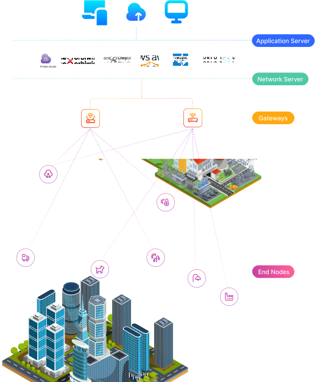

## How LoRaWAN Works — The Postal System Analogy 📮

Imagine **LoRaWAN** as a **city-wide, ultra-efficient postal system** designed for delivering small but important messages between devices. In this system, every component plays a specific role—just like how post offices, mail carriers, and sorting centers work together to deliver letters and parcels.

Each LoRaWAN-enabled device sends its **data "packages"** through this system to reach a central destination (like a server or cloud platform). The process is:
- **Reliable** — messages are verified and acknowledged
- **Secure** — encryption keeps data safe from interception
- **Optimized for long range and low power**, perfect for smart cities, agriculture, industrial monitoring, and more

Whether you're tracking a sensor in a remote field or monitoring a smart meter in an urban building, **LoRaWAN ensures your data gets delivered**—just like the postal service, but for the Internet of Things (IoT).
 

#### LoRaWAN Architecture Explained: The Star-of-Stars Topology

The **LoRaWAN network architecture** follows a **star-of-stars topology**, a scalable and efficient model ideal for large-scale **IoT deployments**. In this model, **end devices** (such as sensors or actuators) communicate with **LoRaWAN gateways**, which forward data to a central **Network Server**.

This structure supports **low-power, long-range communication**—perfect for smart cities, agriculture, healthcare, environmental monitoring, and industrial IoT applications.

## End Devices 
**(Sensors or Actuators = Homes or Businesses)**

In LoRaWAN, **end devices** function like **individual homes or businesses** in a postal system. These are **battery-operated IoT devices** such as:
- Temperature sensors  
- Motion detectors  
- Soil moisture sensors  
- Fall detection wearables  

They send small packets of data only when necessary—much like sending a letter only when there’s something important to say. This power-efficient behavior helps extend battery life, often lasting **multiple years without replacement**.

## Gateways 

**Local Post Offices**

**LoRaWAN gateways** act like **neighborhood post offices**. They do not process or modify the data—they simply **relay messages** between the end devices and the **Network Server**.

Gateways connect to the internet or local servers using technologies like:
- **Wi-Fi**
- **Ethernet**
- **4G/5G cellular**
- **Fiber optic backhaul**

This setup allows thousands of devices to connect simultaneously, even in **rural or underground areas**, enabling **robust, large-area IoT coverage**.

## Indoor vs. Outdoor LoRaWAN Gateways : Which One Do You Need ? 🧐

In a **LoRaWAN network**, **gateways** are the critical bridge between end devices (sensors and actuators) and the network server. There are **two main types of LoRaWAN gateways**—**indoor** and **outdoor**—each designed for different deployment scenarios and coverage needs.

#### Indoor LoRaWAN Gateways (Small Post Hubs)

Think of indoor gateways like **small delivery offices** inside a shopping mall or apartment building. They are designed for **indoor IoT applications** where coverage is needed in areas like:
- **Multi-story buildings**
- **Basements**
- **Warehouses**
- **Retail spaces**

Despite their compact size, some indoor gateways can offer **multi-kilometer coverage**, depending on the environment and signal interference.

> **Ideal for:** Home automation, indoor asset tracking, building management systems, and private network setups.

#### Outdoor LoRaWAN Gateways (Large Post Hubs)

Outdoor gateways are like **major postal hubs** in a city. These **high-power gateways** are installed on rooftops, towers, or poles and equipped with **external antennas** to extend their signal reach.

Outdoor gateways are built to **withstand harsh environments**, featuring **IP-rated weatherproof enclosures** and **high-gain antennas** for broader and more reliable coverage.

> **Ideal for:** Smart agriculture, rural sensor networks, smart city infrastructure, environmental monitoring, and industrial IoT.

💡 **Tip:** Some indoor gateways can be "upgraded" for semi-outdoor use with **waterproof enclosures** and **extended antennas**—a cost-effective solution for small deployments.

By choosing the right type of LoRaWAN gateway based on your deployment area and application, you ensure optimal **IoT connectivity**, **data reliability**, and **long-range communication** performance.

## Core Components of the LoRaWAN Network Architecture

The **LoRaWAN protocol** is not just about long-range wireless communication—it’s also a **highly secure and intelligent IoT system** made up of several key components. These include the **Network Server**, **Application Server**, and **Join Server**—each playing a vital role in managing data, ensuring security, and powering real-world applications.

### Network Server (The Central Post Office)

The **LoRaWAN Network Server** acts like the **main post office** in a city. It handles all the logistics between **LoRaWAN gateways** (delivery hubs) and the cloud-based services or applications.

Key responsibilities:
- 📦 **Deduplicates messages** received from multiple gateways
- 🔐 **Establishes AES-128 encryption** for secure communication
- 🧾 **Authenticates devices**, verifying sender identity and message integrity
- 🧠 **Optimizes responses**, choosing the best gateway for downlink messages to the end device
- 🔁 **Manages network traffic**, ensuring efficient and reliable delivery of IoT data

> **Tip:** This component is critical for ensuring **scalable and secure LoRaWAN deployments** across smart cities, agriculture, healthcare, and industrial IoT.

### Application Server (The Data Intelligence Unit)

Once the data has passed through the Network Server, it reaches the **Application Server**—the part of the system responsible for **processing and interpreting** the incoming information.

Think of it as the city’s **data processing department**, which understands the content of each message (e.g., temperature readings, motion detection, water flow rates).

What it does:
- 📊 **Processes sensor data** for real-time or historical analysis
- 🤖 Supports **advanced analytics**, **machine learning**, or **AI-based insights**
- 📤 Sends notifications, triggers alerts, or visualizes data in dashboards

> The Application Server is key to building **intelligent IoT solutions** from raw LoRaWAN data.

### Join Server (The Security Gatekeeper)

The **LoRaWAN Join Server** is the **security guard** of the network. It ensures that only **authorized devices** are allowed to join and communicate within the network.

Key roles:
- ✅ **Authenticates device join requests**
- 🔐 **Generates session keys** (NwkSKey, AppSKey) to enable encrypted data transfer
- 🔄 **Shares keys securely** with the Network Server and Application Server

> The **Join Server** was introduced in **LoRaWAN v1.1**, but is also supported in **v1.0.4**, helping to **enhance network-level security** and enable **over-the-air activation (OTAA)** for device onboarding.

By working together, these components ensure that **LoRaWAN networks remain scalable, secure, and efficient**, making them a top choice for long-range, low-power IoT deployments.