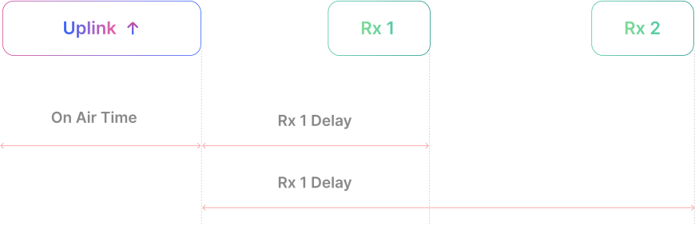
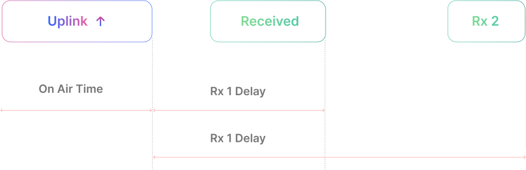
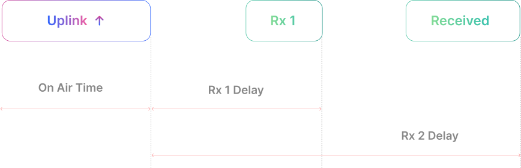
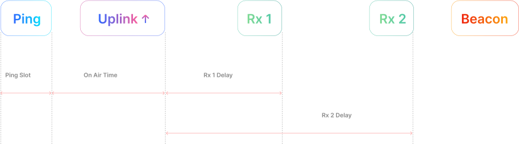
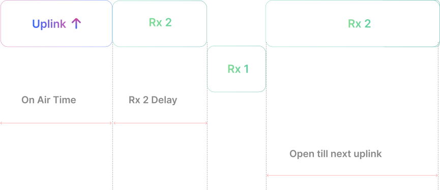

#### LoRaWAN Device Classes: How Devices Communicate

In the world of **LoRaWAN**, devices are grouped into different **communication classes**, similar to how people behave differently at a party. These classes are:

- **Class A** – Sends data and then listens briefly
- **Class B** – Listens at scheduled times
- **Class C** – Always listening for messages

Let’s dive into **Class A**, the most energy-efficient type.

## Class A Devices 

#### How They Act

Class A devices are like the sleepy friend at the party. They can only join the conversation after they’ve had a moment to wake up.

They send out a message whenever they’re ready (like waking up and speaking up), but then they quickly go back to their quiet, sleepy state.

#### Listening Time

After sending a message, they have two short times when they can listen for replies (like a brief moment when they perk up to hear what others are saying). If nobody responds, they won’t hear anything until they decide to wake up and talk again.

<table className="parameter-table">
  <thead>
    <tr>
      <th>Parameter</th>
      <th>Description</th>
    </tr>
  </thead>
  <tbody>
    <tr><td>RX1 Window</td><td>The first chance to hear back</td></tr>
    <tr><td>RX2 Window</td><td>The second chance to hear back if they didn’t get a reply in the first windows</td></tr>
  </tbody>
</table>

#### Delay
There’s a delay between when they finish sending their message and when the listening times begin. These delays are known as RX1 Delay and RX2 Delay.

#### Power Consumption
Class A devices are very energy-efficient. They spend most of their time in sleep mode, conserving battery power and typically have long intervals between messages.

#### No Downlink Received in Either Window

In LoRaWAN communication, when an **end device transmits an uplink message**, it briefly opens **two receive windows (RX1 and RX2)** to listen for any downlink response from the network. If **no downlink is received in either window**, the **communication cycle ends without acknowledgment or data**.

 

This scenario is common in **Class A devices**, where communication is strictly initiated by the device. While it helps conserve power, it also means that **no immediate feedback** is received unless the network successfully sends a downlink within those tight windows.

Such behavior is acceptable in **non-critical IoT use cases**, like:
- Periodic data logging
- Environmental sensing
- Asset tracking without real-time commands

For applications requiring **real-time control or guaranteed delivery**, **Class B or Class C devices** may be more suitable.

#### Downlink Received in the First Window

If the end device receives a **downlink message during the first receive window**, it won’t open the second receive window, as the required data has already been received. By confirming successful delivery early, the device avoids unnecessary listening, making it ideal for **low-power IoT applications** such as smart metering, remote monitoring, and asset tracking.
 

####  Downlink Received in the Second Window

In LoRaWAN networks, if an **end device does not receive a downlink message during the first receive window (RX1)**, it opens a **second receive window (RX2)** after a short delay. If the **downlink is successfully received in RX2**, the message is delivered reliably, even with minor delays. RX2 provides a critical second chance for devices in applications like **smart agriculture**, **industrial IoT**, and **environmental monitoring**, where timely communication is essential.

#### Downlink Latency in Class A Devices

Since they need to **send a message first** to hear back, Class A devices experience high latency for downlink messages

## Real-World Use Cases for Class A LoRaWAN Devices

Despite the higher latency, Class A devices are ideal for **low-power, long-range IoT deployments** where immediate response isn’t necessary. Here are some common applications:

  

    <strong>Environmental Monitoring 🌫️</strong>
    Collecting air quality, humidity, or temperature data at regular intervals.
  

  

    <strong>Wildlife & Animal Tracking 🐾</strong>
    Monitoring the location and activity of endangered species or livestock.
  

  

    <strong>Forest Fire Detection 🔥</strong>
    Sending early warning alerts when rising temperatures or smoke are detected.
  

  

    <strong>Asset Tracking 🎒</strong>
    Keeping tabs on valuable assets or shipments across large distances.
  

  

    <strong>Smart Parking 🅿️</strong>
    Reporting available parking spaces without needing constant connectivity.
  

  

    <strong>Smart Waste Management 🗑️ </strong>
     Monitoring bin fill levels to optimize collection routes and reduce costs.
  

These use cases benefit from the **ultra-low power consumption** and **long battery life** of Class A devices, making them ideal for **remote sensing and periodic reporting applications**.

## Class B Devices 

#### How They Act

Class B devices are like the friend who sets reminders to check in with the group. They have a **special way to know when to listen** thanks to periodic signals called beacons sent out by the network.

#### Listening Time

After they send a message, Class B devices also open two short listening windows (RX1 and RX2) similar to Class A. However, they also periodically open additional listening times called ping slots where they wait for downlink messages.

#### Beacon Period
The time between these beacons helps the device know when to listen for a message from the network

<table className="parameter-table">
  <thead>
    <tr>
      <th>Parameter</th>
      <th>Description</th>
    </tr>
  </thead>
  <tbody>
    <tr><td>RX1 Window</td><td>The first chance to hear back</td></tr>
    <tr><td>RX2 Window</td><td>The second chance to hear back if they didn’t get a reply in the first windows</td></tr>
    <tr><td>Ping Slots</td><td>A capabilities by periodically opening additional receive windows, known as “ping slots,” to allow for more frequent downlink messages.</td></tr>
  </tbody>
</table>

#### Downlink Latency in Class B Devices
They have lower latency for downlink messages than Class A devices because they periodically check in for messages.

#### Power Consumption

Class B devices still use battery power but have shorter battery life compared to Class A because they are active more often, listening for beacons and responding.

#### Downlink Receive Windows

## Real-World Use Cases for Class B LoRaWAN Devices

  

    <strong>Utility Meters ⚡</strong>
    Report usage and receive updates on schedule.
  

  

    <strong>Street Lighting Systems 💡</strong>
    Adjust brightness via timed commands.
  

  

    <strong> Emergency Services 🚨</strong>
    Receive scheduled alerts and instructions.
  

  

    <strong>Asset Tracking 📦</strong>
    Track items with periodic location updates.
  

  

    <strong>Energy Systems 🔋</strong>
    Manage grids or batteries with scheduled control.
  

  

    <strong>Smart Parking 🅿️</strong>
     Monitor and update space availability regularly.
  

## Class C Devices 

#### How They Act

Class C devices are like the buddy who is always **ready to chat.** They keep their ears open for messages almost all the time, except when they’re sending a message.

#### Listening Time

Unlike Class A and Class B, Class C devices open their **listening** windows **continuously** until they need to send an uplink message.

After sending an uplink, they quickly open RX2, followed by RX1, and then keep RX2 open again until the next uplink is scheduled.

#### Beacon Period
The time between these beacons helps the device know when to listen for a message from the network

<table className="parameter-table">
  <thead>
    <tr>
      <th>Parameter</th>
      <th>Description</th>
    </tr>
  </thead>
  <tbody>
    <tr><td>RX1 Window</td><td>The first chance to hear back</td></tr>
    <tr><td>RX2 Window</td><td>Keep RX2 open again until the next uplink is scheduled.</td></tr>
  </tbody>
</table>

#### Downlink Latency in Class C Devices
These devices have the **lowest latency** for downlink messages because they can receive messages at almost any time.

#### Power Consumption

Class C devices **consume a lot of power** since they are almost always listening. They typically can’t rely on batteries for long, so they’re often plugged into a power source.

#### Downlink Receive Windows

## Real-World Use Cases for Class B LoRaWAN Devices

  

    <strong>Utility Meters ⚡</strong>
    Send or receive data instantly when needed.
  

  

    <strong>Street Lighting Systems 💡</strong>
    Adjust brightness via timed commands.
  

  

    <strong>Beacon Lights 🔔</strong>
    Flash or signal promptly when triggered.
  

  

    <strong>Alarms 📦</strong>
    React immediately to alerts or intrusions.
  

  

    <strong>Automation 🤖</strong>
    Real-time control in industrial systems.
  

  

    <strong>Controllers 🎛️</strong>
     Always available for instant command execution.
  

