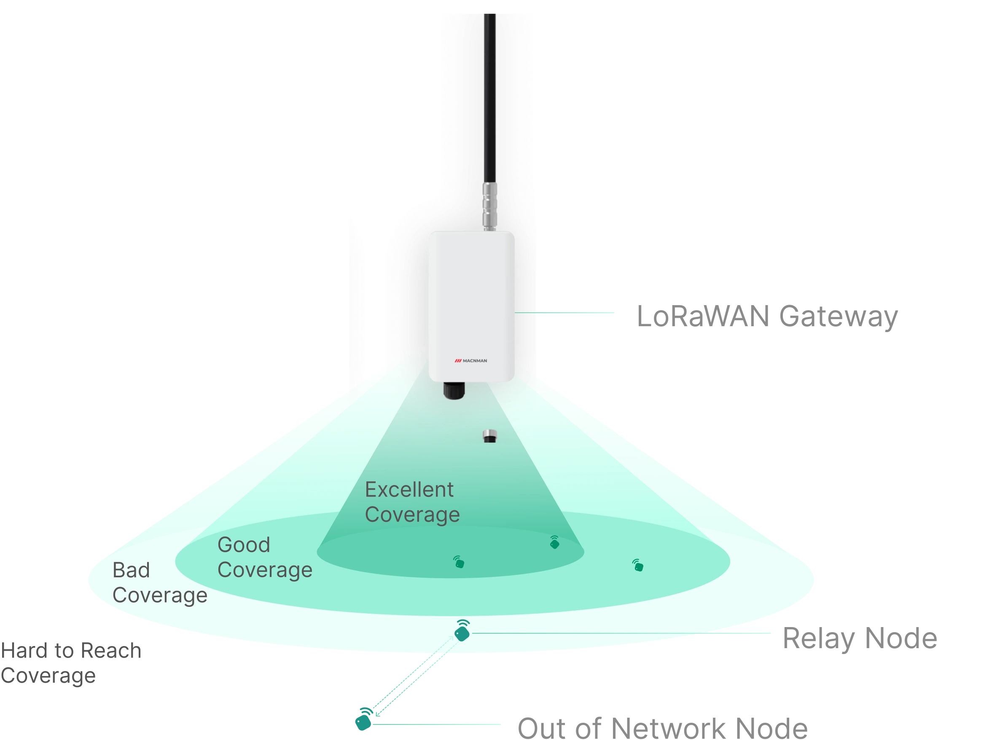

## What is a LoRaWAN Relay ?

Imagine you’re at a noisy party and want to send a message to a friend across the room. Instead of shouting, you ask someone in the middle to **pass the message along.** That person is just like a **LoRaWAN relay.**

In a LoRaWAN network, relays are **low-power, cost-effective devices** that extend communication range. They act as **intermediaries,** forwarding messages from sensors (end devices) that are **too far from a gateway** or are blocked by obstacles such as buildings, trees, or hills.

## Why Use LoRaWAN Relays?

LoRaWAN relays help when **full gateway coverage** isn’t practical or economical. Instead of installing a new gateway (like adding a loudspeaker at a party), a **LoRaWAN relay can bridge the communication gap** for just a few out-of-range sensors.

**Key benefits:**

- **Improves coverage** in hard-to-reach areas
- Offers a **cost-effective alternative** to deploying new gateways
- Maintains **low power consumption**, ideal for remote field operations

## LoRaWAN Relay Technical Requirements

To work properly, LoRaWAN relays and end devices must follow specific technical standards:

#### LoRaWAN Regional Operation Explained

To work properly, LoRaWAN relays and end devices must follow specific technical standards:

- ✅ Must comply with LoRaWAN Relay Specification TS011-1.0.0
- ✅ End devices must support LoRaWAN L2 v1.0.4 (TS001) and Regional Parameters RP2-1.0.3
- ✅ Devices must be compatible with LoRa Basics™ Modem firmware (experimental version available)
- ✅ Requires a sub-GHz LoRa transceiver, such as:
	Semtech SX1261/SX1262
	LR1110, LR1120, or LR1121

These rules ensure fair use and minimal interference between devices in **crowded radio environments**.

## How Does a Relay Work?

Now let’s dive into how the communication happens between the end device (sensor), the relay, and the gateway. We’ll use an analogy of how a message is passed through a third person to explain it simply.

lorawan_relay

**1. Preset Communication Channels**: 
- Before anything happens, the sensor and the relay know in advance which channels (radio frequencies) to use to communicate with each other. It’s like agreeing on which phone line to use to call each other.

**2. Wake-On-Radio (WOR) Message**: 
- The sensor sends a special message called a Wake-On-Radio (WOR) frame to the relay. This WOR message is like tapping someone on the shoulder and saying, “Hey, I need help sending a message. Here’s the information you need, like the frequency and speed we’ll use to communicate.

There are two types of WOR messages the sensor can send

  

    <strong>Relay Join-Request</strong>
    Before anything happens, the sensor and the relay know in advance which channels (radio frequencies) to use to communicate with each other. It’s like agreeing on which phone line to use to call each other.
  

  

    <strong>Relay Uplink</strong>
    This is a Class A uplink where the sensor sends data, similar to, “Here’s the message I need you to forward.
  

**3. Preset Communication Channels**: 

- The relay is usually in a low-power “sleep mode” to conserve energy, but it regularly scans the channel for any incoming messages from the sensor. This scanning process is called Channel Activity Detection (CAD)

- Think of it as the relay setting an alarm to check for any messages every few milliseconds (this can range from 25ms to 1 second, with 1 second being the default). The length of time between these checks is called CADPeriodicity.

**4. Wake-On-Radio (WOR) Message**:

- If the relay detects the WOR message, it quickly switches from CAD mode to reception mode to listen to the message. The time it takes to switch from scanning to receiving is called CadToRx delay.

- The WOR message from the sensor contains a long preamble (like a long knock on the door) to increase the chances that the relay will detect it while scanning.

**5. Relay Sends WOR-ACK**:

- If the relay successfully receives the WOR message, it sends back an acknowledgment called a WOR-ACK frame to let the sensor know that it’s ready to help

- The WOR message from the sensor contains a long preamble (like a long knock on the door) to increase the chances that the relay will detect it while scanning.

#### WOR-ACK Frame: What It Tells the Sensor

The **WOR-ACK frame** contains important information for the sensor to proceed with communication. Here's what it includes:

- **CadToRx**  
  How long it took for the relay to switch from scanning (CAD) to receiving mode.

- **Forward**  
  Indicates whether the relay is ready to forward messages or not.

- **RelayDataRate**  
  The data rate (speed) at which the relay will transmit messages to the gateway.

- **XTALAccuracy**  
  The accuracy of the relay’s crystal oscillator clock.

- **CADPeriodicity**  
  How frequently the relay scans the channel for activity.

- **TOffset**  
  Time difference between the start of the scan and the end of the reception of the WOR preamble.

#### Sensor Sends Data

After receiving the **WOR-ACK**, the sensor transmits its actual payload (such as temperature or humidity readings) to the relay.

- The relay adds **6 bytes of metadata** to this payload.
- This forms a new message called the **Relay Uplink FRMPayload**.

#### Relay Forwards Data to the Gateway

The relay sends the new message to the **gateway** using a special **FPort = 226**.  
The **Network Server** then processes the message, ensuring there are **no duplicates**.

#### Receiving Downlink Messages

If the **Network Server** (or gateway) needs to send a response back to the sensor:

- It sends a **downlink message** to the **relay**.
- The relay then forwards that message to the sensor.
- This is done during the designated **RX1 or RX2 time slots**.

#### Relay Forwards Data to the Gateway

The relay sends the new message to the **gateway** using a special **FPort = 226**.  
The **Network Server** then processes the message, ensuring there are **no duplicates**.

#### Receiving Downlink Messages

If the **Network Server** (or gateway) needs to send a response back to the sensor:

- It sends a **downlink message** to the **relay**.
- The relay then forwards that message to the sensor.
- This is done during the designated **RX1 or RX2 time slots**.

## Where to Place a LoRaWAN Relay?

Placing a **LoRaWAN relay** is similar to strategically positioning people in a large, noisy room to help relay messages. If only a few sensors are struggling to communicate directly with a gateway due to distance or obstacles, adding a relay is a **cost-effective and energy-efficient solution**.

## Regional Parameters for LoRaWAN Relays

Just like mobile phones rely on different networks in different countries, **LoRaWAN relays** follow specific **regional parameters** to ensure smooth communication between sensors, relays, and gateways.

These parameters vary depending on the country or region, affecting how devices operate—especially their frequency bands, data rates, and power settings.

Understanding these parameters is crucial for:
- 🌐 Ensuring global compatibility of your LoRaWAN devices
- 📡 Setting up relays that work correctly within your country’s frequency regulations
- 🔧 Avoiding interference and optimizing network performance

Stay tuned for the region-wise breakdown of frequency bands and settings tailored for relay functionality.

#### Europe (EU868) – Channels for WOR Messages from Sensor to Relay

In the **EU868 frequency band**, LoRaWAN relays use specific channels to handle **Wake-On-Radio (WOR) messages** sent from sensors. These channels are predefined to ensure that devices across Europe communicate reliably without interference.

<table className="parameter-table">
  <thead>
    <tr>
      <th>Channels for WOR Messages from the Server</th>
    </tr>
  </thead>
  <tbody>
    <tr><td>Channel 0</td><td>856.1 MHz</td></tr>
    <tr><td>Channel 1</td><td>865.5 MHz</td></tr>
  </tbody>
</table>

<table className="parameter-table">
  <thead>
    <tr>
      <th>Channels for WOR-ACK from Relay to Sensor</th>
    </tr>
  </thead>
  <tbody>
    <tr><td>Channel 0</td><td>865.3 MHz</td></tr>
    <tr><td>Channel 1</td><td>865.9 MHz</td></tr>
  </tbody>
</table>

#### Key Tips for Relay Placement

- **Weak Signal Zones**: Install relays where end devices frequently lose connection with the gateway—typically in areas with low signal strength or radio interference.
- **Obstructed Areas**: Ideal for tunnels, basements, or areas with heavy structures (like dense walls or machinery) that block signals.
- **Sparse Deployments**: Useful in remote or rural locations where deploying a full gateway might be expensive or unnecessary.

#### Gateway vs. Relay

- If **many devices** in an area can’t reach the gateway, it's better to install **another gateway**.
- If **only a few sensors** are out of range, a **LoRaWAN relay** is the smart and budget-friendly option.

By placing relays at the right spots, you can extend your network coverage, **improve data reliability**, and keep devices **connected without draining batteries or raising costs**.

## Security in LoRaWAN Relays

Ensuring **secure communication** between a sensor (end device) and a LoRaWAN relay is critical for protecting data and preventing unauthorized access. LoRaWAN relays use **specialized session keys** distinct from typical device-to-gateway communication keys.

#### Unique Relay Security Keys

To maintain a secure link, the sensor and the relay use a dedicated **Root Relay Session Key**, known as the **RootWorSKey**. This key is:

- Derived from the sensor’s existing keys
- Shared securely with the relay by the **LoRaWAN Network Server**

From the **RootWorSKey** and the device’s address (**DevAddr**), the following two secure session keys are generated:

#### 1. **WOR Integrity Session Key (WorSIntKey)**  
🔍 This key ensures the integrity of communication. It verifies that **WOR** and **WOR-ACK** messages haven't been tampered with during transmission.

#### 2. **WOR Encryption Session Key (WorSEncKey)**  
🔒 This key is responsible for **encrypting and decrypting the message content**, ensuring that only authorized parties can read the data.

#### ✅ Summary

By using these relay-specific session keys:
- LoRaWAN maintains **end-to-end data privacy**
- Messages are **protected from manipulation**
- Secure relay communication is ensured without affecting the standard network encryption

These keys are a foundational part of **LoRaWAN Relay Security Architecture**, making your **IoT deployments safer and more reliable**.