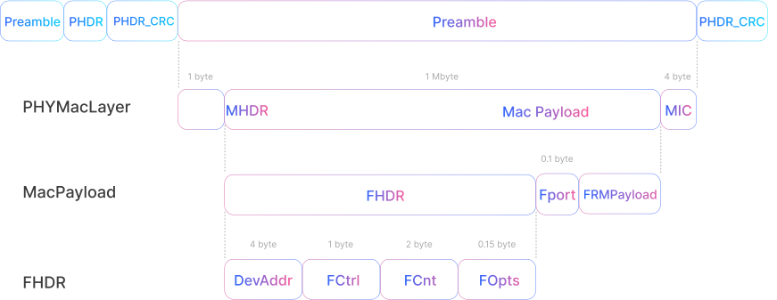

## LoRaWAN Message Types Explained
**Using a Party Analogy**

Let’s break down the different **LoRaWAN message types** using a simple analogy: Imagine LoRaWAN as a party, where devices are guests and messages are notes being passed around. These messages can either be sent (uplink) or received (downlink), and each type serves a specific purpose in the communication process.

## Uplink & Downlink Messages in LoRaWAN

At this smart IoT party, **devices (guests)** communicate with **network servers (organizers)** using different types of messages. These messages fall into two categories:

- **Uplink Messages:** Sent from the device to the server.
- **Downlink Messages:** Sent from the server to the device.

Each message type in LoRaWAN has defined rules for how it's sent, whether it needs a response, and how it’s handled within the **LoRaWAN protocol**.

#### Uplink Messages

**Uplink messages** are like notes sent by party guests to the organizers. Each note travels through one or more **gateways (party assistants)** to reach the network server. These messages typically carry data such as temperature readings, location, or alerts.

#### Downlink Messages

**Downlink messages** are responses or instructions from the **network server** to the **device**. Each message is sent through a single gateway to reach the specific device, making it more targeted and limited compared to uplinks.

## MAC Message Types

LoRaWAN defines various **MAC (Medium Access Control) message types**, which act like different note formats used during the party. Each type plays a role in managing device behavior, ensuring secure communication, and optimizing network performance.

<table className="parameter-table">
  <thead>
    <tr>
      <th>Message Type</th>
      <th>Description</th>
    </tr>
  </thead>
  <tbody>
    <tr>
      <td>Join-request</td>
      <td>A note from the guest asking for entry to the party (device activation)</td>
    </tr>
    <tr>
      <td>Join-accept</td>
      <td>A reply from the organizer granting entry to the party</td>
    </tr>
    <tr>
      <td>Unconfirmed Data Up</td>
      <td>A casual note sent by a guest (end device) where no response is required</td>
    </tr>
    <tr>
      <td>Unconfirmed Data Down</td>
      <td>A casual reply from the organizer (network server) with no need for confirmation</td>
    </tr>
    <tr>
      <td>Confirmed Data Up</td>
      <td>A message from the guest that needs the organizer’s confirmation</td>
    </tr>
    <tr>
      <td>Confirmed Data Down</td>
      <td>A reply from the organizer that requires the guest’s confirmation</td>
    </tr>
    <tr>
      <td>Rejoin-request</td>
      <td>A request from the device to rejoin the network (re-entry to the party)</td>
    </tr>
    <tr>
      <td>Proprietary</td>
      <td>A special, custom message used for non-standard or experimental communications</td>
    </tr>
  </tbody>
</table>

## Join-request
**Asking to Enter the Party**

The **Join-request** message is like a guest sending a polite request to enter the party. This message is always sent **by the end device to the network**.

- In **LoRaWAN versions before 1.0.4**, the **Join-request** is forwarded to the **Application Server**.
- In **LoRaWAN 1.0.4 and 1.1**, it’s directed to the **Join Server**, a dedicated component responsible for authenticating the device and establishing session keys.

## Join-accept 
**Permission Granted to Enter**

The **Join-accept** message is the network’s way of saying, "Yes, you're welcome to the party!"

- In earlier versions of LoRaWAN, this response is sent **from the Application Server**.
- In **LoRaWAN 1.0.4 and 1.1**, the **Join Server** sends the Join-accept response, enhancing **security and network scalability**.

## Rejoin-request
 **Coming Back After Leaving**

A **Rejoin-request** is used when a device that was already part of the network wants to re-establish communication, like a guest returning to the party after stepping out.

- In **LoRaWAN 1.1**, there are **three types of Rejoin-requests** (`Type 0`, `Type 1`, `Type 2`), each with specific rules for how and when they’re used:
  - Some rejoin requests are handled by the **Network Server**
  - Others are forwarded to the **Join Server**

## Data Messages
  
<table className="parameter-table">
  <thead>
    <tr>
      <th>Data Message Type</th>
      <th>Reply Requirement</th>
      <th>Description</th>
    </tr>
  </thead>
  <tbody>
    <tr>
      <td>Confirmed</td>
      <td>✅ Requires a reply</td>
      <td>Ensures the message was received; ideal for critical communication.</td>
    </tr>
    <tr>
      <td>Unconfirmed</td>
      <td>❌ No reply needed</td>
      <td>Faster and more energy-efficient; used for non-critical data transmission.</td>
    </tr>
  </tbody>
</table>

## How LoRaWAN Messages are Packed ?

Imagine each guest’s note has different sections for different types of messages. Here’s how it works

## FOpts Field

Some quick instructions can be packed into the FOpts field — like a little margin on the note where guests can write additional messages.

- In **LoRaWAN 1.0.x**, these are sent **unencrypted**.
- In **LoRaWAN 1.1**, they are **encrypted** using the `NwkSEncKey`.

## FRMPayload Field

Larger messages, like detailed instructions or application-specific data, go in the main section of the note, called the **FRMPayload**.

- If `FPort = 0`: contains only MAC commands from the network server.
- If `FPort = 1–223`: carries application-specific data.

## Message Integrity Code (MIC)

Each message includes a **Message Integrity Code (MIC)** — a cryptographic signature that ensures the message hasn’t been tampered with.

- **Join-request** → `NwkKey`
- **Join-accept** → `JSIntKey` or `AppKey`
- **Data messages** → `NwkSKey`, `FNwkSIntKey`, or `SNwkSIntKey` depending on version

## Encryption Keys

All LoRaWAN messages are **encrypted** for data privacy.

- Different message types and LoRaWAN versions use **specific keys** for encryption.
- Common encryption keys include `AppSKey`, `NwkSKey`, `JSIntKey`, and `NwkSEncKey`.

<table className="parameter-table">
  <thead>
    <tr>
      <th>Type</th>
      <th>Encryption Key Used</th>
    </tr>
  </thead>
  <tbody>
    <tr>
      <td>MAC Commands</td>
      <td>NwkSEncKey</td>
    </tr>
    <tr>
      <td>Application Data</td>
      <td>AppSKey</td>
    </tr>
  </tbody>
</table>

## Summary of Message Types in LoRaWAN

<table className="parameter-table">
  <thead>
    <tr>
      <th>Message Concept</th>
      <th>Description</th>
    </tr>
  </thead>
  <tbody>
    <tr>
      <td>Uplink Messages</td>
      <td>Notes from the guest (end device) to the organizer (network server), sent via party assistants (gateways).</td>
    </tr>
    <tr>
      <td>Downlink Messages</td>
      <td>Replies from the organizer to the guest, relayed through a single assistant (gateway).</td>
    </tr>
    <tr>
      <td>Join-request & Join-accept</td>
      <td>The guest’s request to enter the party and the organizer’s response accepting the entry.</td>
    </tr>
    <tr>
      <td>Confirmed & Unconfirmed Messages</td>
      <td>Determines whether a reply is needed (confirmed) or not (unconfirmed).</td>
    </tr>
    <tr>
      <td>MAC Commands & Application Data</td>
      <td>Encrypted instructions or data embedded in the message for secure communication.</td>
    </tr>
    <tr>
      <td>Message Integrity Code (MIC)</td>
      <td>A cryptographic signature that ensures message authenticity and prevents tampering.</td>
    </tr>
  </tbody>
</table>