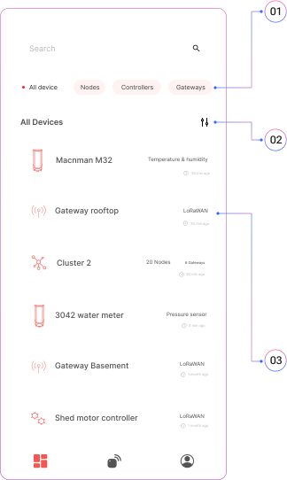

## Account Sign in & Signup

  

    <strong>01</strong>
    
Sign in with your existing account.

  

  

    <strong>02</strong>
    
Sign in with google or create new account.

  

## Home

  

    <strong>01</strong>
    
Use search bar & chips to find your sensors

  

  

    <strong>02</strong>
    
Filter out your devices working with multiple technological filters.

  

  

    <strong>03</strong>
    
You will see your device list along with the last configuration time and sensor types.

  

