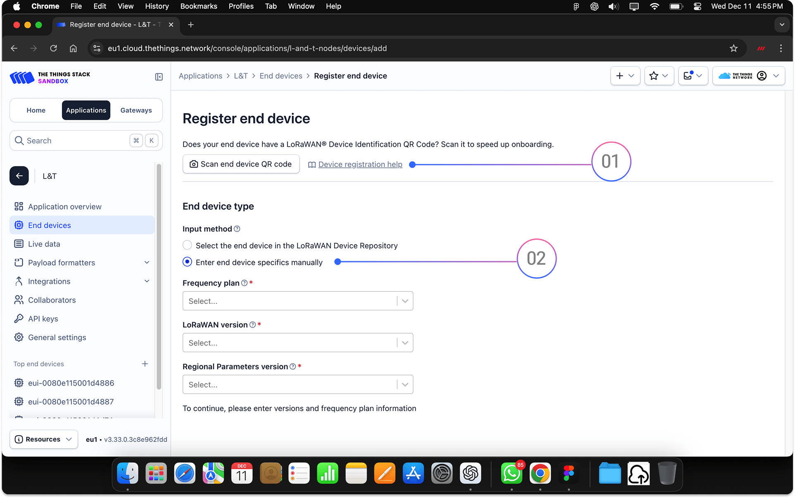
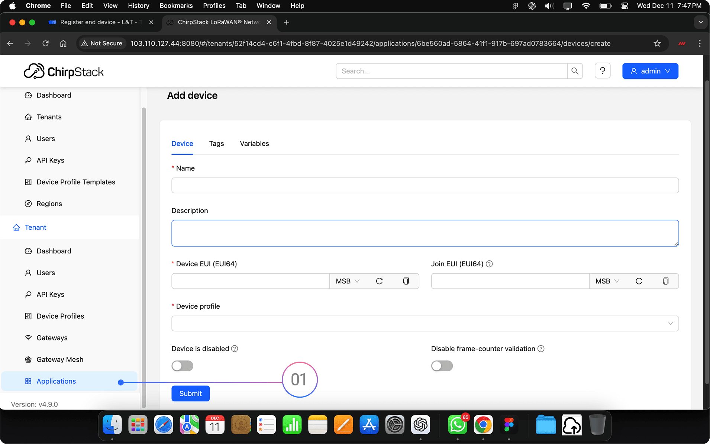

# LNS Registration 

## Public Servers

### Registering MacSync on TTN / Public LNS

You can register your device using either **manual entry** or **QR scan**.

### Option 1: QR Code Registration

1. Click **“Scan End Device QR Code”** on your LNS.
2. In the **Maya App**, open **Key & Identity** and display the QR code.
3. Scan the QR code using your LNS.
4. The device will be automatically registered with all credentials filled in.  

### Option 2: Manual Registration

1. Open your LNS (e.g., [The Things Network](https://www.thethingsnetwork.org/)).
2. Click **“Enter End Device Details Manually.”**
3. In the **Macnman Maya App**, go to the **Key & Identity** section.
4. Copy the following:
   - **DevEUI**
   - **AppEUI**
   - **AppKey**
5. Paste these into the corresponding fields on your LNS.
6. Select the correct **LoRaWAN frequency plan** (e.g., IN865, EU868, etc.).
7. Complete the registration process.

> Tip: For advanced security or re-onboarding, you can regenerate keys anytime from the **Maya App** under **Key & Identity > Advanced Options**.

## Public Servers

### Registering MacSync Device on ChirpStack (Private LNS)

Follow these steps to onboard your device into your ChirpStack application:

### Step-by-Step Instructions

1. **Log in** to your ChirpStack dashboard.
2. Click on **“Applications”** from the sidebar.
3. Select your existing application or create a new one.
4. Click **“Add Device”** (top-right corner).
5. Open the **Maya App** and go to the **Key & Identity** section.
6. Copy the following values:
   - **DevEUI**
   - **JoinEUI** (AppEUI)
   - **AppKey**
7. Paste these into the corresponding fields in ChirpStack.
8. Click **Submit** to register the device.

> For enhanced security, you can regenerate the keys directly from the Maya app before registration.