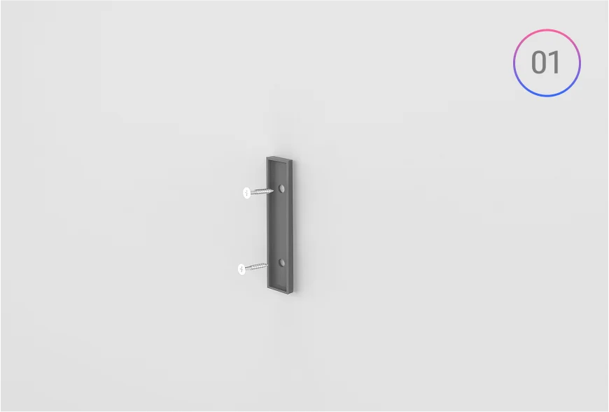
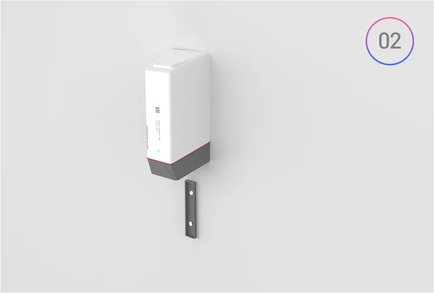
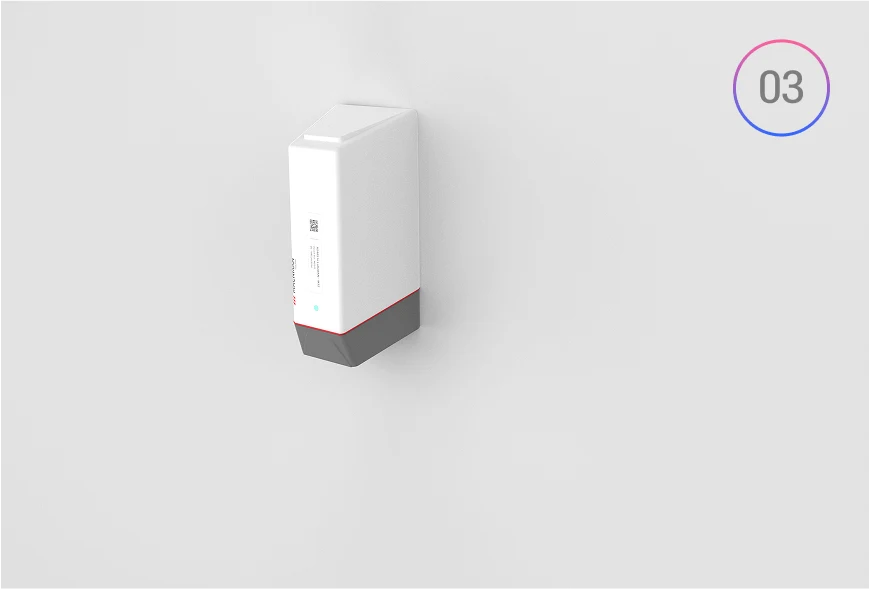

# Installation Guide

## Wall Mounting

**Apply the Reference Tape**
- Take the provided white tape (with two pre-marked reference holes) from the box and stick it onto the wall where you plan to install the sensor. This will serve as a drilling template.

**Drill Mounting Holes**
- Drill the holes as per the markings on the tape to ensure perfect alignment.

**Fix the Mounting Bracket**
- Screw the bracket securely to the wall using the drilled holes.

**Mount the Sensor**
- Slide the MacSync sensor downward into the bracket until it clicks and locks in place.

**Secure the Sensor (Optional)**
- For additional security, use the extra screw holes on the opposite side to further fasten the sensor.

