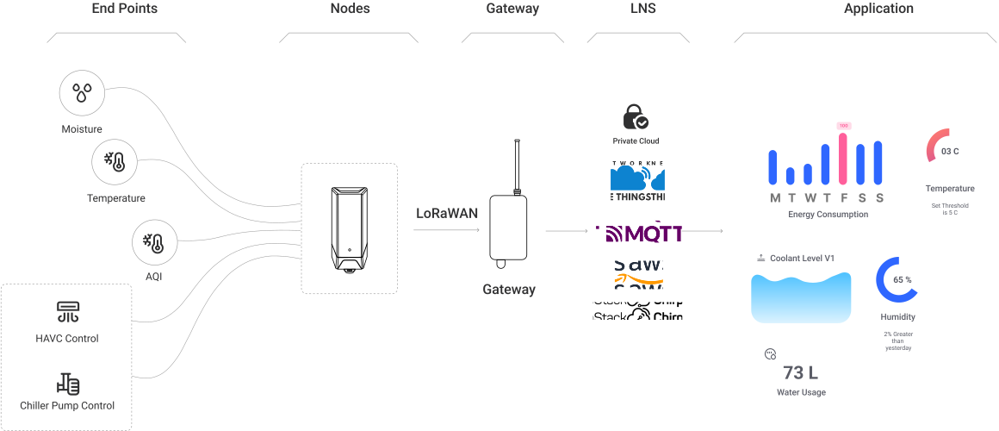

# Product Overview

## Introduction

**MacSync** is an innovative IoT data logger developed by **Macnman Technologies** to simplify and enhance real-time monitoring and control across various environments. Built with industrial-grade hardware and intelligent software, MacSync offers a versatile and reliable solution for applications ranging from industrial automation to environmental monitoring.

Designed for seamless integration, MacSync supports connectivity with both **RS485 & Analog sensors**, making it adaptable to a wide variety of systems and use cases. Whether it’s tracking temperature and humidity, monitoring water levels, or controlling field devices, MacSync delivers accurate, real-time data with ease.

Configuration is quick and user-friendly using the [**Macnman Maya App**](https://play.google.com/store/apps/details?id=com.macnman.app&pcampaignid=web_share), which leverages Bluetooth Low Energy (BLE). Through the app, users can set parameters, adjust logging intervals, and manage data settings directly from their smartphone—no technical expertise required.

With its rugged design, flexible sensor support, and intelligent wireless configuration, MacSync is built for professionals who need dependable data logging in the field, on the shop floor, or in remote environments.

## Product Architecture
  

## Core Features

  

    <strong>Multi-Sensor Compatibility</strong>
    
Supports a wide range of environmental and industrial sensors including CO₂, temperature, humidity, and soil sensors.

  

  

    <strong>Universal Sensor Integration</strong>
    
Works seamlessly with RS485 and analog sensors (4–20 mA / 0–10 V) for broad system compatibility..

  

  

    <strong>Secure by Design</strong> 
    
Features an STSAFE chip for encrypted storage and secure device authentication*.

  

  

    <strong>Onboard Data Storage</strong>
    
Stores up to 3 years of data locally for uninterrupted logging.

  

  

    <strong>Rugged & Reliable</strong>
    
Built to withstand extreme conditions in industrial and outdoor environments.

  

  

    <strong>Simple Configuration via Maya App</strong>
    
Enables fast and easy setup through the BLE-powered Maya mobile app.

  

## Applications

- **Integrated MCU**  
  Monitor and control machinery, production lines, and industrial systems to improve efficiency, uptime, and operational safety.

- **Developer-Ready SDK**  
  Measure air quality, humidity, soil conditions, and other environmental parameters to support agriculture, sustainability, and research.

- **Smart Buildings**  
  Integrate real-time sensing for temperature, air quality, and lighting to optimize energy usage and enhance occupant comfort.

- **Safety and Security**
  Deploy sensors to detect intrusions or hazardous conditions, enabling instant alerts and preventive actions in critical areas.

## Ideal For

- **Businesses**  
  Implement IoT-driven solutions to streamline operations, reduce costs, and improve real-time decision-making.

- **Researchers**  
  Collect precise environmental and scientific data using reliable, field-ready sensing and logging tools.

- **Facility Managers**  
  Enhance building performance with intelligent monitoring of energy use, air quality, and equipment status.

## Why do you need this user manual ?

Following are the several reasons you need this manual.

- **Effective Product Utilization** 

- **Troubleshooting Assistance** 

- **Maintenance & Care** 

- **Warranty & Service Information** 

- **Regulatory Compliance** 

- **Enhanced User Experience** 

- **Resource for Training** 

## Key parameters Definitions

Following are the several reasons you need this manual.

<table className="parameter-table">
  <thead>
    <tr>
      <th>Parameter</th>
      <th>Description</th>
    </tr>
  </thead>
  <tbody>
    <tr>
      <td>LoRaWAN Mac version</td>
      <td>LoRaWAN MAC versions, evolving from 1.0 to 1.1, 1.0.3, and the latest 1.1.1, define the communication protocols and enhancements in network efficiency, security, and device compatibility for LoRaWAN networks.</td>
    </tr>
    <tr>
      <td>Device EUI</td>
      <td>Unique identification of the device, one of the join network parameters (OTAA mode)</td>
    </tr>
    <tr>
      <td>App EUI</td>
      <td>Unique identification of the application, one of the join network parameters</td>
    </tr>
     <tr>
      <td>App Key</td>
      <td>Application key, one of the join network parameters</td>
    </tr>
     <tr>
      <td>Device code</td>
      <td>On the device label, for device binding and API call</td>
    </tr>
      <tr>
      <td>LoRaWAN range</td>
      <td>02 Km Urban , 08 Km LoS </td>
    </tr>
      <tr>
      <td>Cloud platforms</td>
      <td> Private Clouds , On Prim , Chirpstack , TTN , Helium , Loriot , Orbiwise </td>
    </tr>
  </tbody>
</table>
