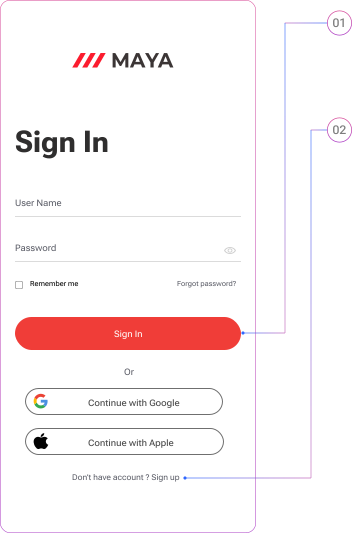
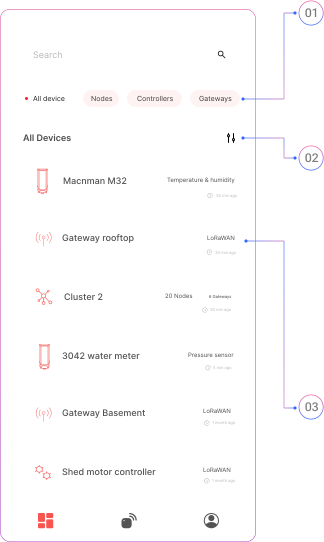
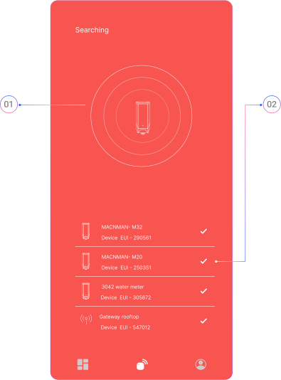

## Sign In to Your Account

To access the Macnman Maya app and manage your devices:
- **Sign in using your Google** account for quick access.
- Or, **create a new account** using your email address if you prefer not to use Google login.

Once signed in, you’ll be able to view, configure, and monitor all your registered Macnman devices.

## Home

Home allows you to manage and monitor all your Macnman devices efficiently from one place.

**01. Search Bar**  
  Use the **search bar** at the top to quickly locate a specific sensor or device by name or ID.

**02. Device Filters**  
  Use the **filter options** to narrow down your devices based on communication technology (e.g., LoRaWAN, Wi-Fi, 4G) or device type.

**03. Device Card**  
  Each device is displayed as a **card** showing:
  - Device name
  - Last configuration timestamp
  - Connected sensor types

## Connecting to a Macnman Sensor

Macnman sensors operate in always-on mode, allowing them to be discovered at any time via Bluetooth.

- **Discover Devices**  
  Go to the **BLE Search tab** in the Maya app to scan for and list all nearby Macnman devices.

- **Connect to a Sensor**  
  Select the sensor you want to configure from the list.
  If **security is enabled, you may need authentication** based on the device’s security level.
  To restrict access, consider setting a higher security level to limit configuration to authorized users only.

- **Access Configuration**  
  Once connected, the app will automatically navigate to the device’s configuration page, where you can set parameters, update firmware, or view diagnostics.
