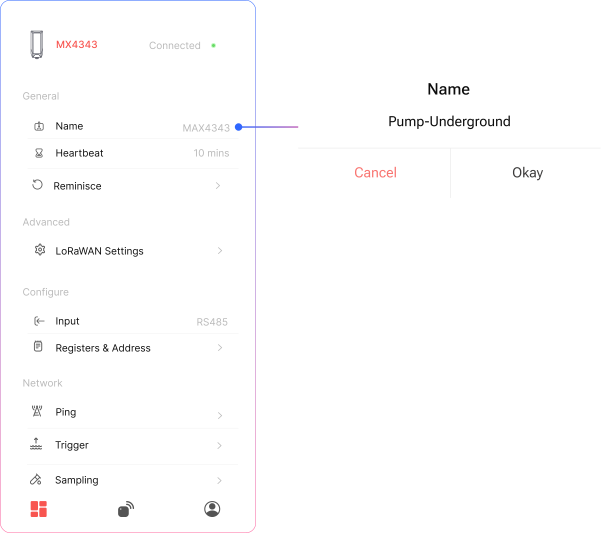
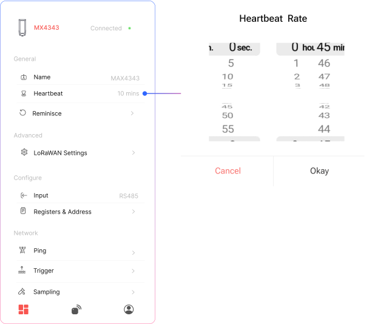
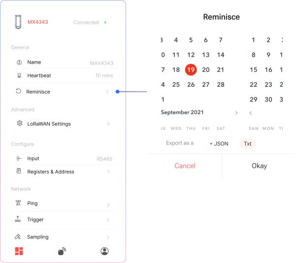

## Rename device

  

    <strong>Name</strong>
    
Rename your device. Maximum 20 Chars are allowed

  

## Change Heartbeat

  

    <strong>What is Heartbeat?</strong>
    
Heartbeat is how often your device sends a status update to the server to confirm it’s active and connected.

  

  

    <strong>Example</strong>
    
 A 15-minute heartbeat means the device sends a signal to the server every 15 minutes, even if no data has changed.

  

## Reminisce

  

    <strong>1</strong>
    
Select a date range to export your stored onboard data.

  

  

    <strong>2</strong>
    
Choose the export format - JSON or TXT.

  

   

    <strong>3</strong>
    
Click “OK” to start the download. You will receive a notification once the data is downloaded successfully.

  

