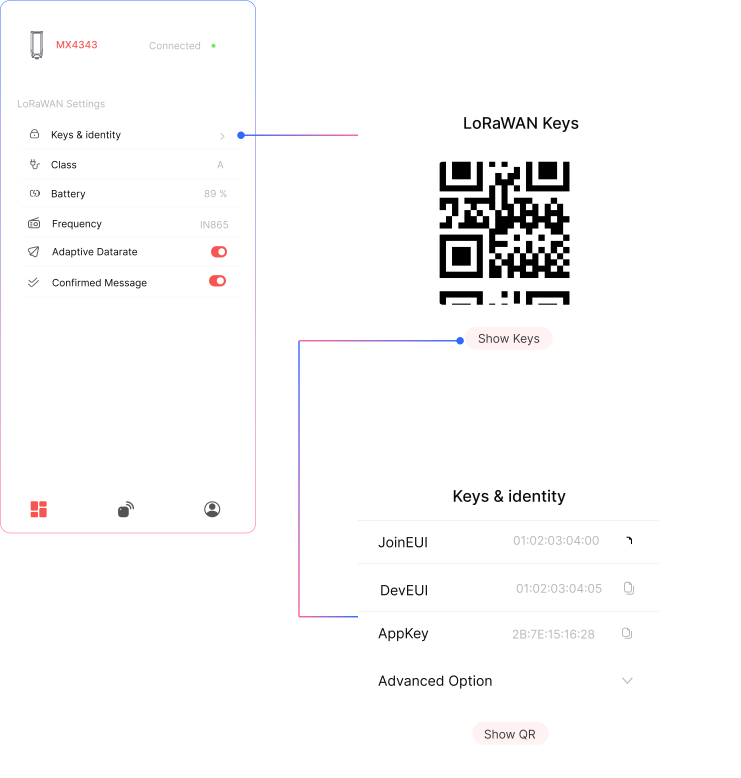
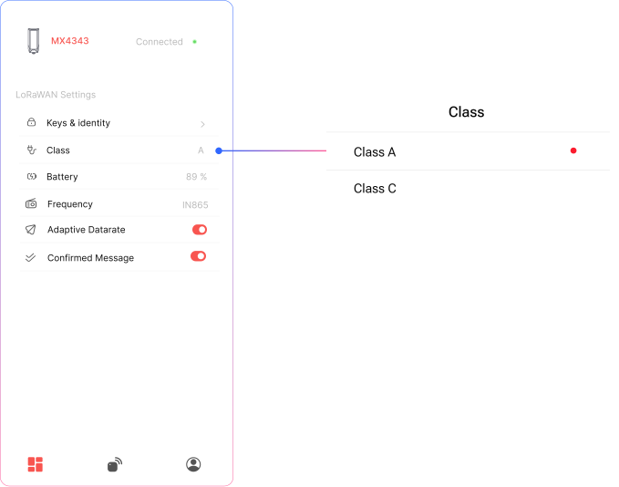
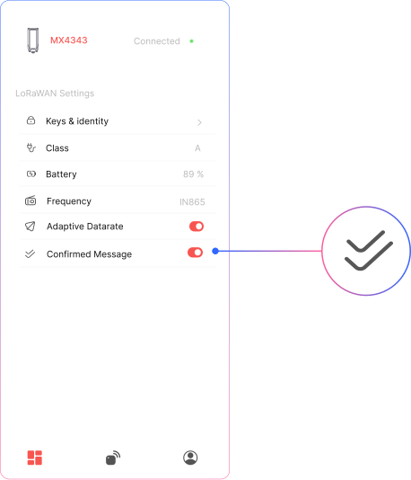

## Keys & Identities

  

    <strong>QR Code</strong>
    
Scan QR code to register your device on most of LNS

  

   

    <strong>Keys</strong>
    
If you want to see keys use click on keys button below QR code

  

## Device Class

  

    <strong>LoRaWAN Class</strong>
    
Change the working class of your device.

  

  

    <strong>Class A</strong>
    
 Use for battery-powered devices , it offers the lowest power consumption and is ideal for sensors that transmit occasionally.

  

  

    <strong>Class C</strong>
    
Use for mains-powered devices — it keeps the receiver always on, enabling near-instant downlink communication.

  

## Device frequency

  

    <strong>LoRaWAN Frequency</strong>
    
Choose the LoRaWAN frequency for your region.

  

  

    <strong>Class A</strong>
    
 Use for battery-powered devices , it offers the lowest power consumption and is ideal for sensors that transmit occasionally.

  

  

    <strong>Class C</strong>
    
Use for mains-powered devices — it keeps the receiver always on, enabling near-instant downlink communication.

  

## Adaptive Data Rate

  

    <strong>ADR</strong>
    
Toggle ON to enable Adaptive Data Rate, allowing the device to automatically optimize transmission settings for power efficiency and network performance.

  

  

    <strong>Custom SF</strong>
    
 Toggle OFF to manually set the Spreading Factor (SF).

  

  

    <strong>Adjustments</strong>
    
Use the “+” and “–” buttons to adjust the spreading factor based on your range and data rate requirements.

  

## Confirmed Messages

  

    <strong>Confirmed Messages</strong>
    
Toggle ON to enable Confirmed Messages, which require an acknowledgment from the server for each uplink.

  

  

    <strong>Airtime</strong>
    
 This ensures reliable data delivery but may increase power usage and airtime.

  

