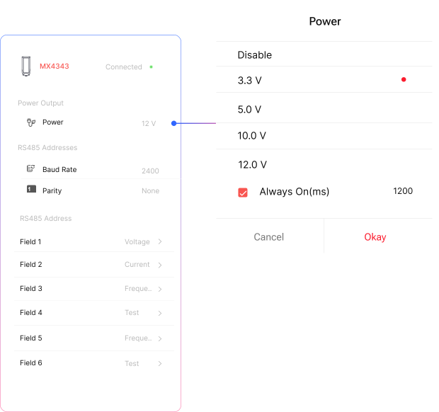
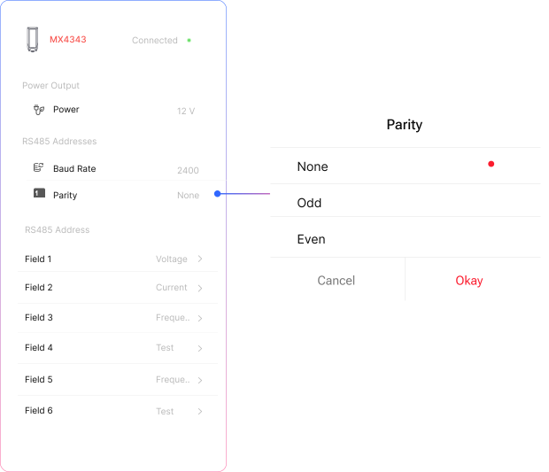
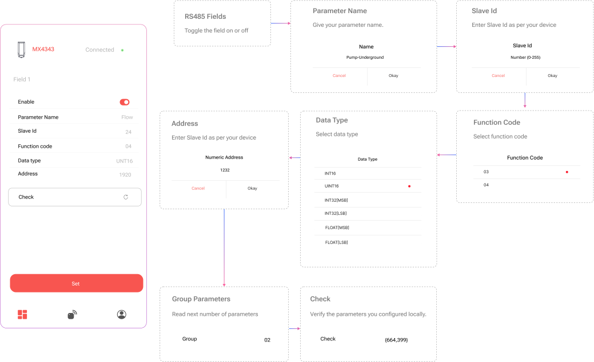

## RS485 Selection

- **RS485 & Analog Mode Switching**  
To connect a sensor, first select the appropriate mode — either RS485 or Analog — depending on the sensor type.

- **RS485 Address Configuration**  
  Once **RS485 mode** is selected, **navigate to the RS485 Address** section to configure the device address and other communication parameters required for the sensor to function correctly.

## Power Output & Initialization Settings - RS485 

- **Power Output**  
Select the appropriate **output power level** from the list based on your sensor’s operating voltage or current requirements. This determines how much power the device supplies to the connected sensor.

- **Sensor Initialization Time**  
  Enter the **initialization time (range: 0–2000 ms)** required by your sensor to stabilize and begin operating after power is applied.

:::note

**Power Consumption** : The connected sensor will draw power directly from the device

:::

:::note

**Sensor Warmup Time**: Some sensors need a brief warm-up period before they can start sending accurate data.

:::

## Baud Rate

Select the **baud rate** that **matches your sensor or device’s communication speed**.
Using the correct baud rate ensures proper data transmission over RS485 or similar serial interfaces.

- **Common values:**  
  `9600` , `19200` ,`38400`,`115200`, - (check your sensor’s datasheet).

## Parity

Choose the parity type — `None`, `Even`, or `Odd` — based on your sensor’s communication protocol.
Parity is used for basic error detection in serial communication.

Refer to your sensor’s documentation to select the correct setting. **Mismatched parity** can **result in failed or corrupted data** transfers.

## RS485 Field Setup  

Follow the steps below to configure RS485-based sensors or devices through the Maya app:

**01. Enable RS485 Field**  
- Toggle the “Enable Field” switch to activate RS485 configuration for a specific channel.

**01. Enable RS485 Field**  
- Toggle the **“Enable Field”** switch to activate RS485 configuration for a specific channel.

**02. Parameter Name (Optional)**  
- Assign a custom **parameter name** for easier identification in reports or the Maya app.  
*Example: `Soil_Moisture`, `Energy_Meter_KW`*

**03. Slave ID**  
- Enter the **Slave ID** of the RS485 device.  
*Example: `1`, `2`, `10`* (Check your device's Modbus documentation)

**04. Function Code**  
Select the appropriate **Modbus Function Code**:  
- `0x03` – Read Holding Registers  
- `0x04` – Read Input Registers

**05. Data Type**  
- Choose the correct **data format** expected from the device:  
- `INT16`, `UINT16`, `INT32`, `FLOAT32`, etc.  
Make sure this matches the sensor’s Modbus register definition.

**06. Register Address**  
- Enter the **starting register address** to read from.  
Refer to your device’s Modbus register map.

**07. Number of Parameters (Group Read)**  
- Define how many **registers** to read in a single request.  
*Example: `2` for `FLOAT32`, `1` for `INT16`*

**08. Check Values**  
- Click the **“Check”** button to verify that the device is returning valid data using the selected configuration.
