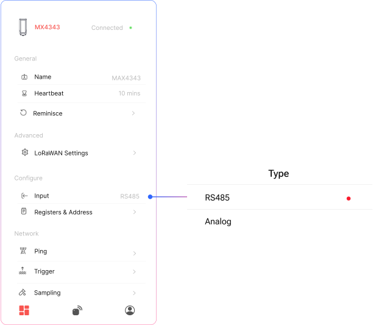
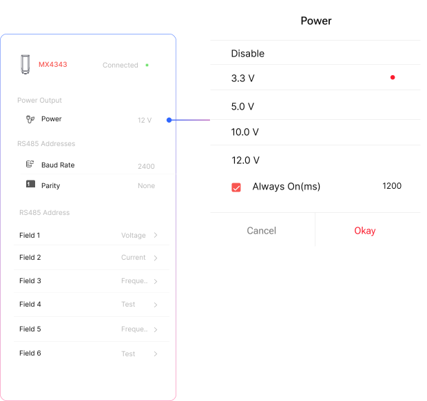
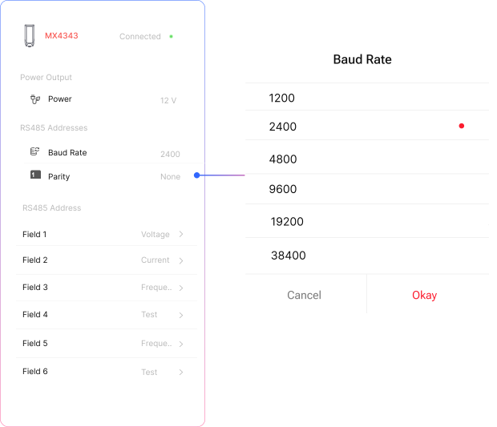
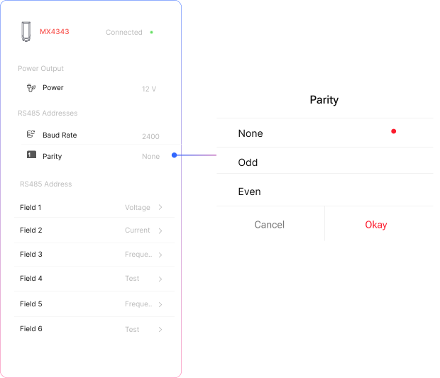

## RS485 Selection

  

    <strong>RS485 & Analog Mode Switching</strong>
    
To use a specific type, simply switch the device to the desired mode before connecting the sensor.

  

   

    <strong>RS485 Address</strong>
    
Then go to RS485 Address page for further configurations

  

## Power Output & Initialization Settings

  

    <strong>Power Output</strong>
    
Select the appropriate output power from the list based on your sensor’s requirements.

  

  

    <strong>Sensor Initialization Time</strong>
    
 Enter the required initialization time (0-2000 ms) for your sensor to start functioning properly after power-up.

  

  

    <strong>Sensor Initialization Time</strong>
    
 Enter the required initialization time for your sensor to start functioning properly after power-up.

  

:::note

Power Consumption : The connected sensor will draw power directly from the device

:::

:::note

Sensor Warmup Time: The connected sensor will draw power directly from the device

:::

## Baud Rate

  

    <strong>Baud Rate</strong>
    
Select the baud rate that matches your sensor or device’s communication setting.

  

  

## Parity

  

    <strong>Parity</strong>
    
Select the parity type (None, Even, or Odd) based on your sensor’s communication protocol.

  

  

## RS485 Field Setup  

