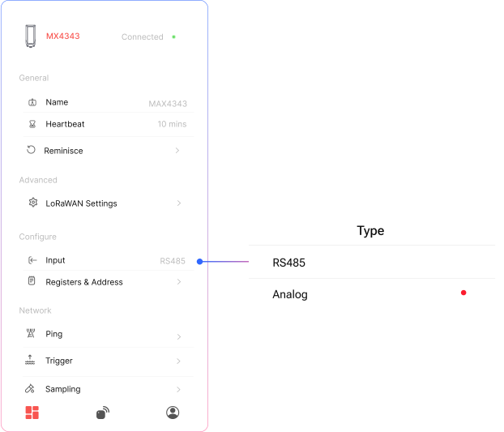
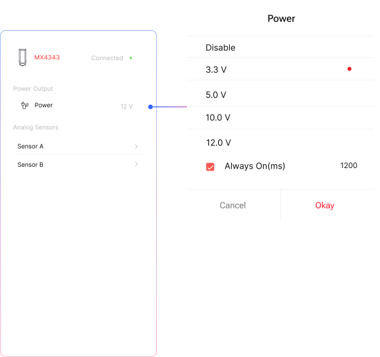
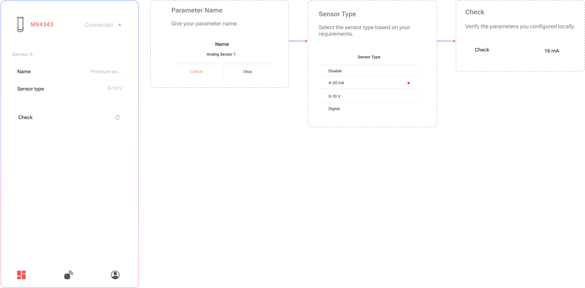

## Setting Up Analog Sensors

- **RS485 & Analog Mode Switching**  
To connect a sensor, first select the appropriate mode — either RS485 or Analog — depending on the sensor type.

- **Analog Channel Configuration**  
  Once **Analog Mode** is selected, **navigate to the Analog Channel** section to configure the device types and other communication parameters required for the sensor to function correctly.

## Power Output & Initialization Settings - Analog

- **Power Output**  
Select the appropriate **output power level** from the list based on your sensor’s operating voltage or current requirements. This determines how much power the device supplies to the connected sensor.

- **Sensor Initialization Time**  
  Enter the **initialization time (range: 0–2000 ms)** required by your sensor to stabilize and begin operating after power is applied.

:::note

**Power Consumption** : The connected sensor will draw power directly from the device

:::

:::note

**Sensor Warmup Time**: Some sensors need a brief warm-up period before they can start sending accurate data.

:::

## Analog Channel Setup 

**01. Channel Name (Optional)**  
Assign a custom **name to the channel** for easier identification in the app or exported data.  
*Example: `Water_Level`, `Door_Status`*

**02. Select Sensor Type**  
Choose the sensor type connected to the channel:  
- `4–20 mA`  
- `0–10 V`  
- `Digital Input`  
You can also choose **"Disable"** to deactivate the channel if it's unused.

**03. Independent Channel Configuration**  
Each channel (Channel 1 and Channel 2) is configured separately.  
This means you can use **different sensor types** on each channel based on your application.  
*Example: Channel 1 → 4–20 mA, Channel 2 → Digital Input*

**04. Check Values**  
Use the **“Check”** option to verify that the connected sensor is providing correct values.  
This helps ensure proper wiring, power, and signal compatibility before final deployment.