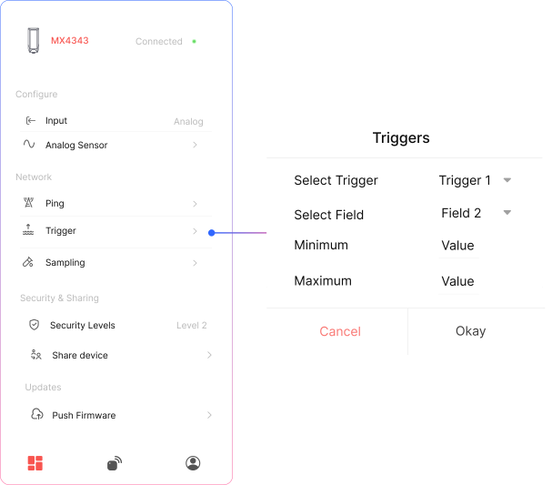

## Trigger Configuration

You can configure the device to automatically send an uplink when a specific sensor value crosses a defined threshold.

## How it works:
- Select **Trigger 1** or **Trigger 2** from the dropdown.
- Choose the **field number** (sensor/data field) to monitor.
- Set the **minimum and maximum threshold values**.
- The device will send an uplink **whenever the selected field value goes outside the defined range**.