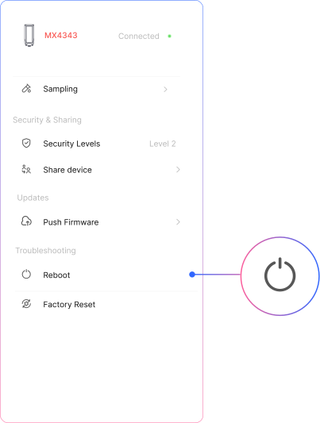
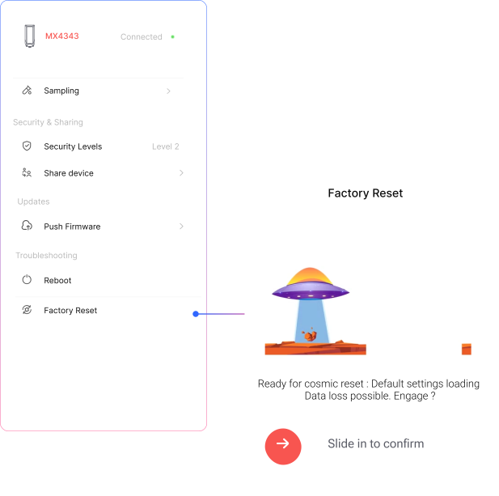

## Reboot

**Device Reboot**  
Performs a **soft restart** of the device.  
This is useful for applying configuration changes or recovering from temporary issues without erasing any stored data or settings.

## Factory Reset

**Factory Reset**  
Restores the device to its **original factory settings**.  
All configurations, stored data, and paired connections will be erased.  
Use this option with caution, especially in live deployments.

:::note

After a factory reset, the device must be reconfigured before it can resume operation.

:::