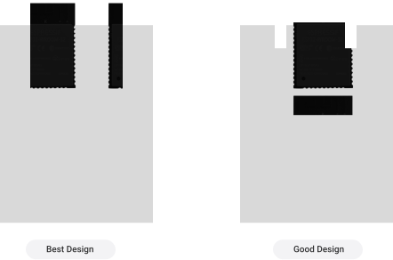
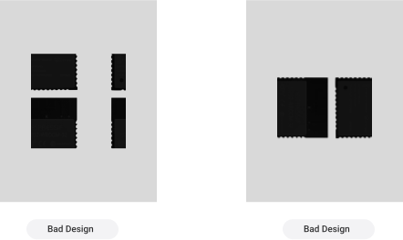

## Recommmended PCB Layouts

To ensure optimal antenna performance, the module antenna area must remain free of GND planes, metal crosswiring, or nearby components. It is recommended to design a hollow or clear area around the antenna or position the
module along the edge of the PCB.

## Notes for Maximum Performance
- **Antenna Clearance**  
  Ensure the module’s u.FL connector and external antenna area are completely free from obstructions, especially metallic components or enclosures, as these can significantly degrade antenna performance.

- **External Copper Coverage**  
  Apply a copper shield around the PCB, excluding the antenna area, to minimize interference from high-frequency signals, signal cables, and disturbances from other components.

- **Clearance Area**  
  Maintain a clearance zone of at least 4 square centimeters around the antenna area, including any enclosure, to reduce performance degradation caused by proximity to materials or circuits.

- **Grounding**  
  Ensure proper grounding of the device and the module. A solid ground plane should be placed beneath the module to reduce parasitic inductance and improve overall stability.

- **Avoid Copper Under Antenna**  
  Do not place copper, traces, or ground planes directly under the module’s antenna path or near the external antenna connector to prevent signal interference or radiation inefficiencies.

- **Distance from Other Circuits**  
  Position the module’s antenna at least 15 mm away from high-speed signals, power circuits, or noisy components to preserve radiation efficiency and avoid interference.

- **Placement**  
  Place the MAC32WLE5 module near the edge of the PCB, with the u.FL connector facing outward to minimize interference and ensure the external antenna can radiate freely.  
  Keep the module away from dense circuitry to enhance RF performance.

- **Power Supply Isolation**  
  Use magnetic beads and low-ESR capacitors to insulate and filter the power supply to the module, ensuring clean and stable voltage delivery. This reduces noise interference and enhances overall stability.

