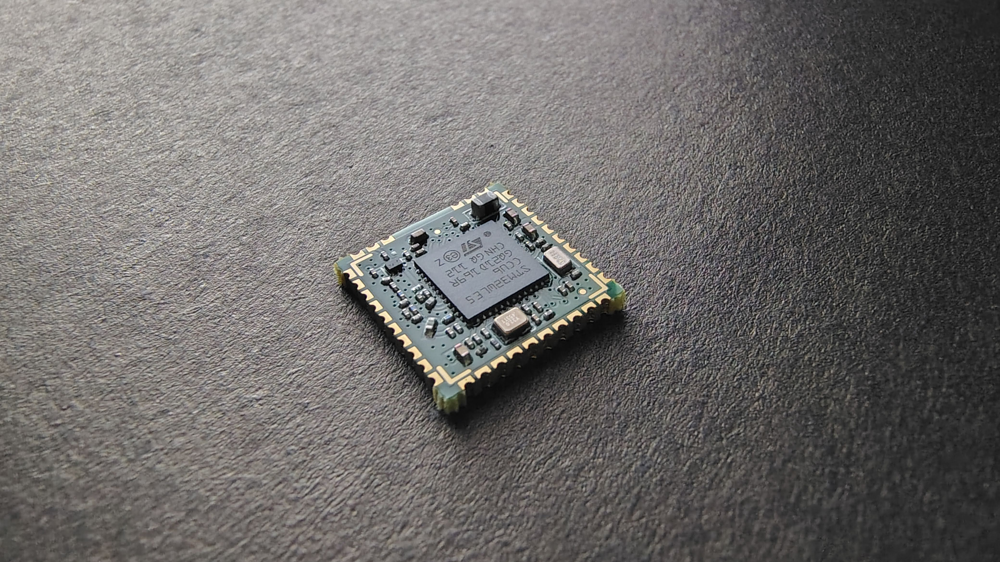
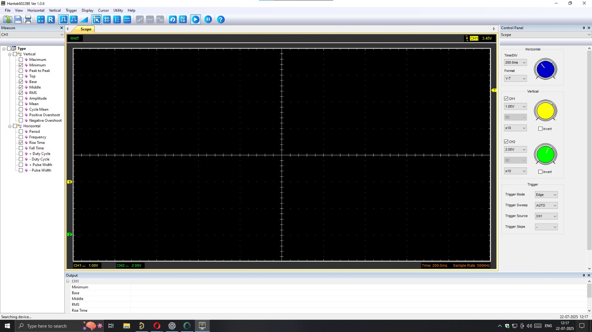

# Overview 




<section className="specs-section">
  <div className="specs-grid">
    <div className="specs-title" style={{ marginRight: '5rem', marginBottom: '2rem' }}>
      <h2>General<br />Specifications</h2>
    </div>
    <div className="specs-details">
      <div className="spec-row">
        <div className="spec-label">Part Order Number</div>
        <div className="spec-value"><strong>MacSync-L-XX-XX</strong></div>
      </div>
      <div className="spec-row">
        <div className="spec-label">Product Brand</div>
        <div className="spec-value"><strong>Macnman Technologies Pvt Ltd</strong></div>
      </div>
    </div>
  </div>
  <hr style={{ border: 'none', borderTop: '1px solid #e0e0e0', margin: '2rem 0' }} />
</section>

<section className="interfaces-section">
  <div className="section-title">
    <h2>Interfaces</h2>
  </div>
  <div className="interfaces-grid" style={{ gap: '1rem' }}>
    <div className="interface-box"><strong>1</strong> x RS485</div>
    <div className="interface-box"><strong>2</strong> x 4-20 mA</div>
    <div className="interface-box"><strong>2</strong> x 0-10 V</div>
    <div className="interface-box"><strong>2</strong> x Digital</div>
    <div className="interface-box"><strong>1</strong> x I2C</div>
    <div className="interface-box"><strong>1</strong> x UART</div>
  </div>
  <p style={{ fontSize: '0.75rem', color: '#888', marginTop: '0.5rem' }}>
    With the MacSync Series, a single interface can be used at a time. I2C & UART is for internal purposes.
  </p>
</section>

<style>{`
  .hover-table tbody tr:hover {
    background-color: #f0f4ff;
  }
`}</style>

<table className="hover-table">
  <thead>
    <tr>
      <th>Parameter</th>
      <th>Description</th>
      <th>Value</th>
    </tr>
  </thead>
  <tbody>
    <tr>
      <td>Model</td>
      <td>Product model number</td>
      <td>MacSync-L-XX</td>
    </tr>
    <tr>
      <td>Power Supply</td>
      <td>Operating voltage range</td>
      <td>9V - 36V DC</td>
    </tr>
    <tr>
      <td>Operating Temp</td>
      <td>Temperature range</td>
      <td>-20°C to 65°C</td>
    </tr>
  </tbody>
</table>





<div className="card-demo">
  <div className="card">
    <div className="card__image">
      
    </div>
    <div className="card__body">
      <h4>Quaco Lighthouse</h4>
      <small>
        The Quaco Head Lighthouse is a well maintained lighthouse close to St.
        Martins. It is a short, beautiful walk to the lighthouse along the
        seashore.
      </small>
    </div>
    <div className="card__footer">
      <a href="https://macnman.com" className="button button--primary button--block">Visit</a>
    </div>
  </div>
</div>

<div className="svg-demo">
  <h2>LoRa SVG Demo</h2>
  
</div>
## 🔧 Python Example: Reading Sensor Data

```python
import time
import random

def read_temperature():
    # Simulated sensor read
    return round(20 + random.uniform(-2, 2), 2)

def read_humidity():
    return round(50 + random.uniform(-5, 5), 2)

while True:
    temp = read_temperature()
    humidity = read_humidity()
    print(f"Temperature: {temp}°C, Humidity: {humidity}%")
    time.sleep(5)
```


<div class="card-demo">
  <div class="card">
    <div class="card__header">
      <h3>Lorem Ipsum</h3>
    </div>
    <div class="card__body">
      <p>
        Lorem ipsum dolor sit amet, consectetur adipiscing elit, sed do eiusmod
        tempor incididunt ut labore et dolore magna aliqua. Quis ipsum
        suspendisse ultrices gravida.
      </p>
    </div>
    <div class="card__footer">
      <button class="button button--secondary button--block">  All</button>
    </div>
  </div>
</div>

<!-- This is section with the icons and tab glow on hover -->

## 📦 Quick Access

<div className="icon-card-grid">
  <a href="#" className="icon-card">
    <div className="icon">📘</div>
    <div>
      <strong>Getting Started</strong>
      <p>Begin your journey with Macnman products and platforms.</p>
    </div>
  </a>
  <a href="#" className="icon-card">
    <div className="icon">😁</div>
    <div>
      <strong>Developer Tools</strong>
      <p>Access SDKs, firmware files, and debugging utilities.</p>
    </div>
  </a>
  <a href="#" className="icon-card">
    <div className="icon">🛠️</div>
    <div>
      <strong>Configuration Guides</strong>
      <p>Set up your sensors and controllers with step-by-step docs.</p>
    </div>
  </a>
</div>

<!-- This is section with shpoes the tab glow on hover -->

## Most popular

<div className="most-popular-grid">
  <a href="https://macnman.com/usermanuals" className="popular-card" target="_blank" rel="noopener">
    <strong>User Manuals</strong>
    <p>Setup and usage guides for Macnman devices.</p>
  </a>

  <a href="https://macnman.com/datasheets" className="popular-card" target="_blank" rel="noopener">
    <strong>Datasheets</strong>
    <p>Technical specifications of all hardware products.</p>
  </a>

  <a href="https://macnman.com/books" className="popular-card" target="_blank" rel="noopener">
    <strong>Books</strong>
    <p>Explore detailed guides and learning resources.</p>
  </a>

  <a href="https://macnman.com/blogs" className="popular-card" target="_blank" rel="noopener">
    <strong>Blogs</strong>
    <p>Read the latest in IoT and device development.</p>
  </a>
</div>

<div className="briefspecsstyle">
  <div className="column">
    <div className="label">Supported Class</div>
    <div className="value">Class A, Class C</div>
    <div className="label">Frequency</div>
    <div className="value">EU868, IN865</div>
  </div>
  <div className="column">
    <div className="label">LoRaWAN Antenna</div>
    <div className="value">Internal</div>
    <div className="label">Antenna Sensitivity</div>
    <div className="value">-136 dBm</div>
  </div>
</div>


<div className="generalSpecsStyle">
  <div className="left-title">General{"\n"}Specifications</div>
  <div className="right-content">
    <div>
      <div className="label">Part Order Number</div>
      <div className="value">MacSync-L-XX-XX</div>
    </div>
    <div>
      <div className="label">Part Order Number</div>
      <div className="value">MacSync-L-XX-XX</div>
    </div>
    <div>
      <div className="label">Part Order Number</div>
      <div className="value">MacSync-L-XX-XX</div>
    </div>
    
  </div>
</div>

---

<div className="generalSpecsWithImageStyle">
  <div className="left-title">Module Overview</div>
  <div className="right-content">
    
  </div>
</div>


<table className="parameter-table">
  <thead>
    <tr>
      <th>Parameter</th>
      <th>Description</th>
      <th>Description</th>
      <th>Type</th>
    </tr>
  </thead>
  <tbody>
    <tr>
      <td>frequency</td>
      <td>Sets the radio frequency band.</td>
      <td>String</td>
      <td>String</td>
    </tr>
    <tr>
      <td>power</td>
      <td>Defines output transmission power.</td>
      <td>Number (dBm)</td>
      <td>Number (dBm)</td>
    </tr>
    <tr>
      <td>power</td>
      <td>Defines output transmission power.</td>
      <td>Number (dBm)</td>
      <td>Number (dBm)</td>
    </tr>
  </tbody>
</table>

<div className="reusable-feature-grid">
  <div className="reusable-feature-card">
    <strong>Wireless Communication</strong>
    <p>No more messy wires or accessibility issues.</p>
  </div>
  <div className="reusable-feature-card">
    <strong>Real-Time Alerts</strong>
    <p>Instant notifications ensured proactive responses.</p>
  </div>
  <div className="reusable-feature-card">
    <strong>Real-Time Alerts</strong>
    <p>Instant notifications ensured proactive responses.</p>
  </div>
</div>

<div className="problem-grid">
  <div className="problem-card">
    
    <strong>Disconnected Systems</strong>
    <p>Monitoring relied on wired sensors that frequently malfunctioned, especially in areas with poor access.</p>
  </div>

  <div className="problem-card">
    
    <strong>Delayed Responses</strong>
    <p>By the time temperature issues were identified manually, the damage was already done.</p>
  </div>

  <div className="problem-card">
    
    <strong>Costly Maintenance</strong>
    <p>Repairing broken wires or replacing outdated components was both time-consuming and expensive.</p>
  </div>

  <div className="problem-card">
    
    <strong>Regulatory Pressures</strong>
    <p>Accurate and continuous logging of temperature and humidity was non-negotiable for audits, but their system couldn’t ensure it.</p>
  </div>
</div>