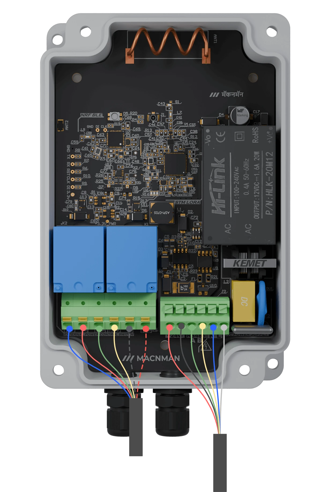
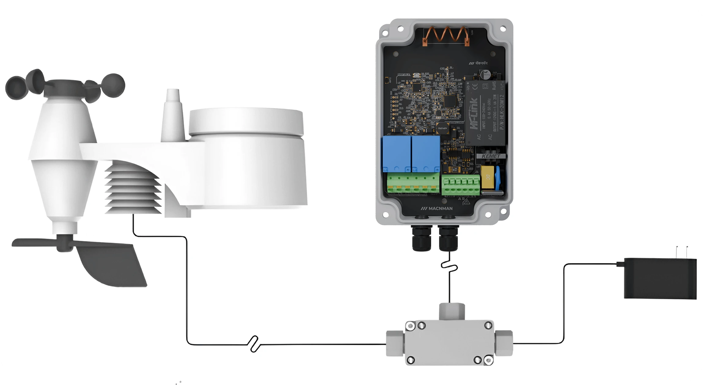
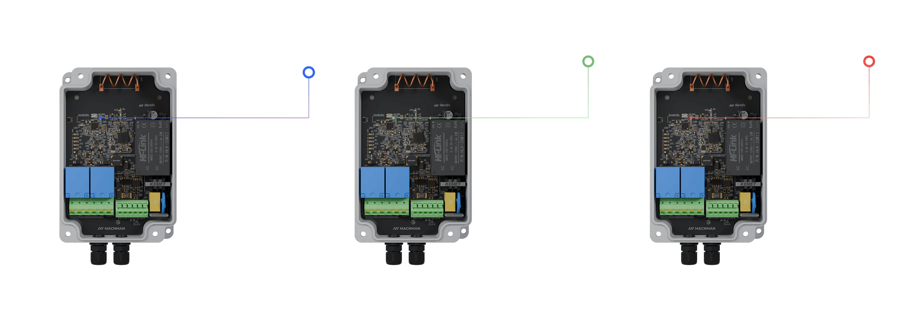

# Power Options in MacSet

## External Power Supply
MacSet also supports direct external power input (12–24 V DC):
- Ensure wiring is done as per MacSet and the sensor manufacturer’s power and polarity specifications.
- This is ideal for installations where continuous power is available and high-frequency data logging is required.

## Terminal Connections

## Procedure for Connecting External Power

MacSet can also be powered through a **direct external DC** source within a **12–24 V** range. Ensure proper connection using a compatible terminal or jack, and always refer to both MacSet and sensor manufacturer specifications for safe operation.

### Connecting External Sensors

- **Check Sensor Specifications**  
  Ensure compatibility with MacSet's input requirements.

- **Power Off the device**  
  Turn off MacSet before making any connections.

- **Attach Sensor Cables**  
  Connect cables to the appropriate inputs on MacSet, following the sensor manufacturer’s pin 
configuration and power on device.

- **Configure via Maya App**  
  Power on MacSet and configure it using the Maya app to adjust settings as per your needs.

### Connecting External Power Supply

- **Verify Power Supply**  
  Confirm the power supply matches MacSet's 12-24 V requirement. Turn off both MacSet and the 
power source before connecting.

- **Connect Power Cable , Insure safety**  
  Turn off MacSet before making any connections.

## Led Status

  

    <strong>Blue</strong>
    
Device is connected with Maya app & Flashing Blue - OTA in progress. 

  

  

    <strong>Green</strong>
    
Slow green blink - attempting to connect to the network.

  

  

    <strong>Red blink</strong> 
    
Modifying any confirmed parameters of MacSet.

  

