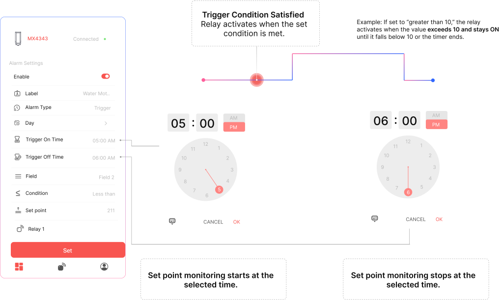

## Trigger Scheduling

## Trigger Schedule Setup Flow

The **Trigger Schedule** mode activates a relay when a specific condition is met. Follow these steps to configure it in the Maya app:

#### Steps to Configure

1. **Toggle ON the Schedule**  
   Enable the Schedule switch to begin configuration.

2. **Assign a Label**  
   Name your Schedule (e.g., `Overheat Protection`) to easily identify it later.

3. **Select Schedule Type**  
   Choose **Trigger** from the available Schedule modes.

4. **Choose Active Days**  
   Select the day(s) when this Schedule should be active.

5. **Set Monitoring Time Window**  
   - **Start Time** – Time to begin monitoring  
   - **Stop Time** – Time to stop monitoring

6. **Select Parameter Source**  
   Choose the field (RS485 or Analog) whose value should be monitored.

7. **Define Trigger Condition**  
   - Select logic: `Greater than`, `Less than`, or `Equal to`  
   - Enter the **Set Value** (e.g., `80°C` or `25 PSI`)

8. **Set Trigger Duration (Optional)**  
   If needed, specify how long the relay should remain ON after being triggered.

9. **Select Relay Output**  
   Choose the relay channel that should activate when the condition is met.

10. **Save the Schedule**  
    Tap **Set** to activate the configured Schedule logic.

## Auto-Off Logic - Tigger Schedule

Once triggered, the relay will **turn ON**. It will **turn OFF automatically** when either of the following occurs:

- The monitored parameter **returns below the set threshold** (for “greater than” logic)  
- OR the **trigger duration ends** (if a timer is defined)

## Tigger Schedule Example

#### Overheating Protection in Machinery

*I want my **motor to shut off automatically if its temperature goes above 80°C.** This will help me prevent overheating and downtime. It **should only operate again once the temperature drops** or I manually reset it.*

**Label:** `Overheat Shutdown`  
**Condition:** Temp > 80°C  
**Relay ON Duration:** 15 minutes  
**Time Window:** 9:00 AM – 5:00 PM on weekdays  

The relay will activate if the temperature crosses 80°C and stay ON for 15 minutes or until the temperature drops.
