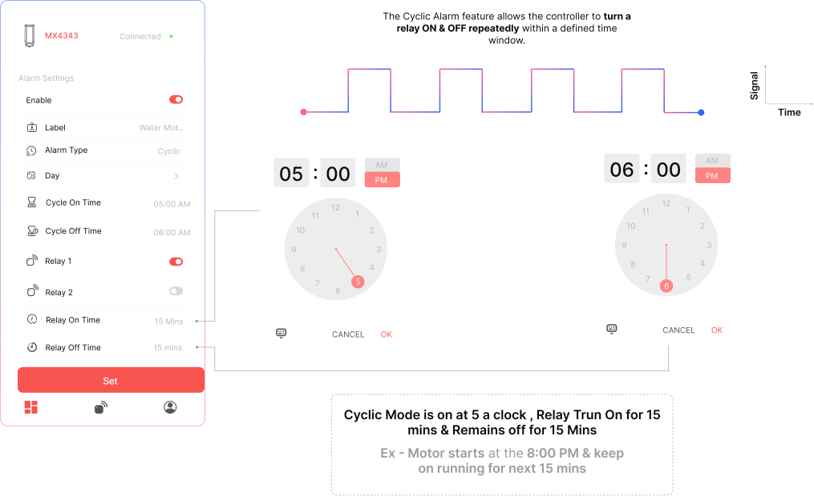

## Cyclic Scheduling

## Cyclic Schedule Setup Flow

The **Cyclic Schedule** allows the relay to switch ON and OFF repeatedly during a defined active window, ideal for scheduled pulse operations like irrigation, air circulation, or motor cycling.

#### Steps to Configure

1. **Toggle ON the Schedule**  
   Enable the Schedule switch to begin configuration.

2. **Assign a Label**  
   Provide a meaningful name for the schedule (e.g., `Irrigation Cycle`).

3. **Choose Active Days**  
   Select the day(s) when the cyclic schedule should be active.

4. **Set Monitoring Time Window**  
   - **Start Time** – When the cyclic schedule should begin  
   - **Stop Time** – When the cyclic schedule should end

5. **Set Relay ON and OFF Durations**  
   - **Relay ON Time** – Duration the relay remains ON in each cycle (e.g., 15 minutes)  
   - **Relay OFF Time** – Duration the relay remains OFF in each cycle (e.g., 10 minutes)

6. **Select Relay Output and Action**  
   Choose the relay channel to control, and define what action it should perform during each cycle.

7. **Save the Schedule**  
   Tap **Set** to activate the cyclic schedule.

## Cyclic Operation Logic

Once activated, the controller will:
- Turn the relay **ON** for the configured Relay ON Time
- Then turn it **OFF** for the configured Relay OFF Time
- Repeat this cycle until the Stop Time is reached

## Cyclic Schedule Example

#### Scheduled Pump Cycling for Irrigation

*I want my **irrigation pump to turn ON for 15 minutes and OFF for 10 minutes**, starting at 4:00 PM and stopping at 5:00 PM on selected days. This cycle should repeat automatically during this period.*

**Label:** `Evening Irrigation`  
**Days Active:** Monday to Saturday  
**Start Time:** 4:00 PM  
**Stop Time:** 5:00 PM  
**Relay ON Time:** 15 minutes  
**Relay OFF Time:** 10 minutes  
**Relay:** Relay 1

The pump will cycle ON and OFF between 4:00 PM and 5:00 PM every scheduled day.
