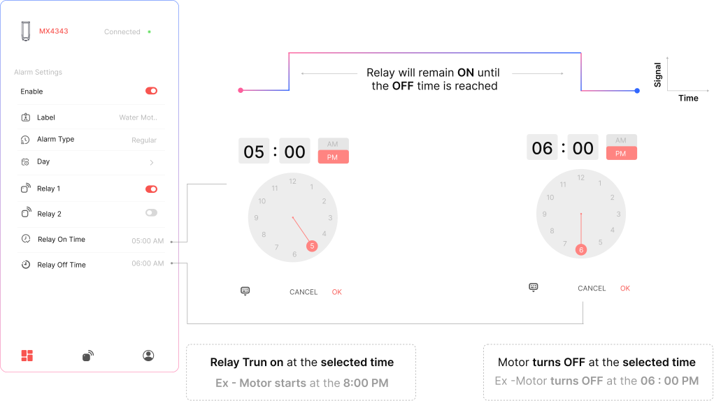
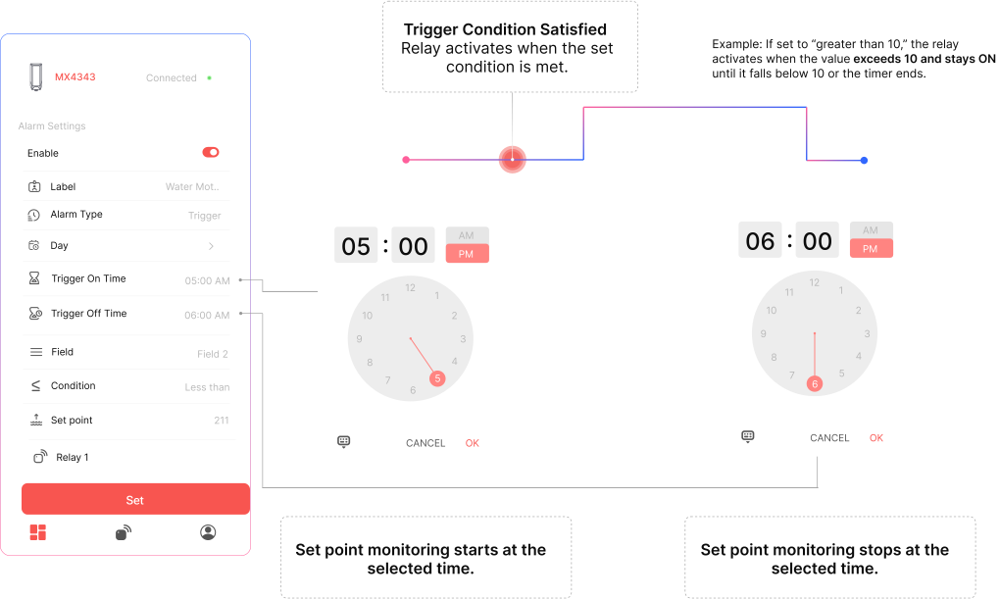

# Scheduling Alarms in MacSet

## Regular Scheduling

The **Regular Alarm** allows users to schedule specific relays to turn ON and OFF at defined times, on selected days. This is ideal for automating lights, pumps, ventilation, and other time-based operations.

#### Steps to Configure

1. **Toggle ON the Alarm**  
   Enable the alarm slot to begin configuration.

2. **Assign a Label**  
   Give your alarm a name (e.g., `Daily Pump Cycle`) to easily identify it later.

3. **Select Alarm Type**  
   Choose **Regular** or **Scheduled** as the alarm type.

4. **Choose Active Days**  
   Select which day(s) of the week the schedule should be applied to.

5. **Select Relay and Define Action**  
   Choose the relay you want to control. Use the toggle switch to specify whether the relay should be enabled or disabled according to the scheduled times.

6. **Set Relay ON Time and OFF Time**  
   - **Relay ON Time**: The time at which the relay will turn ON  
   - **Relay OFF Time**: The time at which the relay will turn OFF

7. **Save the Alarm**  
   Tap **Set** to save and activate the schedule.

## Regular Scheduling Relay Action Logic

Once configured, the selected relay will:

- Turn **ON** at the specified ON Time  
- Turn **OFF** at the specified OFF Time  
- This ON/OFF cycle will repeat on the chosen days  
- No parameter monitoring is involved — this is a fixed, time-based schedule

## Tigger Alarm Example

#### Overheating Protection in Machinery

*I want the office **lights to turn ON automatically at 6:30 PM and turn OFF at 11:00 PM** from Monday to Friday. This helps ensure proper lighting during late working hours without needing manual operation every day.*

#### Evening Lights Automation in Office Premises

**Label:** `Evening Lights`  
**Days Active:** Monday to Friday  
**Relay:** Relay 2  
**Relay ON Time:** 6:30 PM  
**Relay OFF Time:** 11:00 PM  
  
**Result:** Relay 2 will turn ON at 6:30 PM and turn OFF at 11:00 PM every weekday automatically.

## Trigger Alarm

## Trigger Alarm Setup Flow

The **Trigger Alarm** mode activates a relay when a specific condition is met. Follow these steps to configure it in the Maya app:

#### Steps to Configure

1. **Toggle ON the Alarm**  
   Enable the alarm switch to begin configuration.

2. **Assign a Label**  
   Name your alarm (e.g., `Overheat Protection`) to easily identify it later.

3. **Select Alarm Type**  
   Choose **Trigger** from the available alarm modes.

4. **Choose Active Days**  
   Select the day(s) when this alarm should be active.

5. **Set Monitoring Time Window**  
   - **Start Time** – Time to begin monitoring  
   - **Stop Time** – Time to stop monitoring

6. **Select Parameter Source**  
   Choose the field (RS485 or Analog) whose value should be monitored.

7. **Define Trigger Condition**  
   - Select logic: `Greater than`, `Less than`, or `Equal to`  
   - Enter the **Set Value** (e.g., `80°C` or `25 PSI`)

8. **Set Trigger Duration (Optional)**  
   If needed, specify how long the relay should remain ON after being triggered.

9. **Select Relay Output**  
   Choose the relay channel that should activate when the condition is met.

10. **Save the Alarm**  
    Tap **Set** to activate the configured alarm logic.

## Auto-Off Logic - Tigger Alarm

Once triggered, the relay will **turn ON**. It will **turn OFF automatically** when either of the following occurs:

- The monitored parameter **returns below the set threshold** (for “greater than” logic)  
- OR the **trigger duration ends** (if a timer is defined)

## Tigger Alarm Example

#### Overheating Protection in Machinery

*I want my **motor to shut off automatically if its temperature goes above 80°C.** This will help me prevent overheating and downtime. It **should only operate again once the temperature drops** or I manually reset it.*

**Label:** `Overheat Shutdown`  
**Condition:** Temp > 80°C  
**Relay ON Duration:** 15 minutes  
**Time Window:** 9:00 AM – 5:00 PM on weekdays  

The relay will activate if the temperature crosses 80°C and stay ON for 15 minutes or until the temperature drops.
