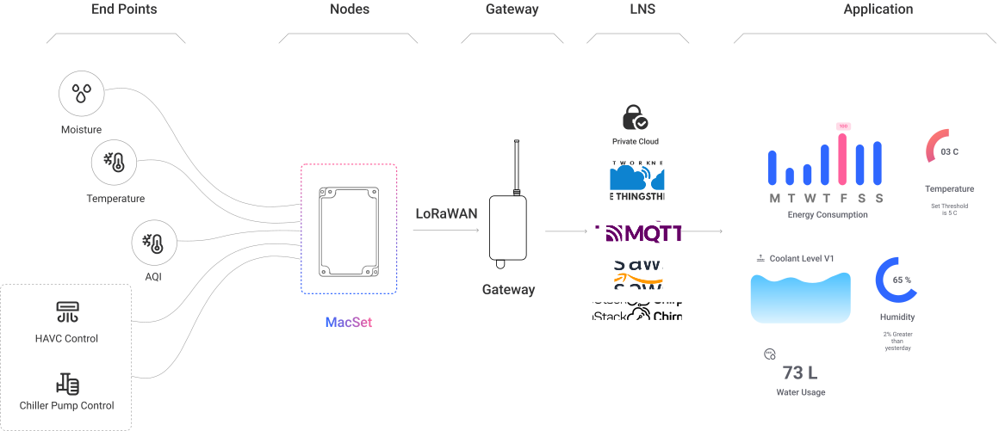

# Product Overview

## Introduction

**MacSet LoRaWAN® Controller** by Macnman Technologies is a rugged, industrial-grade **IoT control** module engineered for remote **automation and control in** both connected and **disconnected environments**. Designed to work over LoRaWAN® networks, it offers ultra-low power operation, long-range communication, and reliable performance even in harsh and remote locations.

Ideal for smart agriculture, industrial automation, water management, smart buildings, and smart cities, MacSet allows users to monitor and **control motors, pumps, valves, fans,** and other field equipment—completely wirelessly.

With support for **RS485, analog control (0–10V / 4–20mA)**, and **relay output**, MacSet ensures seamless integration with existing PLCs, sensors, and actuators.

## Product Architecture
 

## Core Features

  

    <strong>Automated Scheduling & Logic Control</strong>
    
Enables pre-programmed operation of connected devices based on schedules, sensor inputs, or preset 
      conditions, optimizing energy usage and system performance.

  

  

    <strong>Seamless Remote Control</strong>
    
The LoRaWAN Controller enables precise remote control of motors, pumps, fans, and valves, ensuring 
efficient automation across industrial and agricultural applications.

  

  

    <strong>Multi-Device Compatibility</strong> 
    
Supports both RS485 and analog (0-10V / 4-20mA) outputs, allowing seamless integration with a wide range of 
      existing equipment without requiring hardware modifications.

  

  

    <strong>User-Friendly Configuration</strong>
    
Easily configure and manage device settings through the Macnman Maya app, providing an intuitive interface 
      for remote operation, scheduling, and automation.

  

  

    <strong>Two-Way Communication</strong>
    
Supports real-time bidirectional control, allowing users to monitor device status and send commands 
    remotely for enhanced operational efficiency.

  

  

    <strong>Durable and Reliable</strong>
    
Built for extreme environments, the controller is resistant to dust, moisture, and temperature fluctuations, 
    ensuring durability in harsh industrial and outdoor conditions.

  

    

    <strong>Offline Operation</strong>
    
Features internal memory to store operation logs and settings, ensuring continuous functionality even during
network disruptions.

    

        

    <strong>Over-the-Air (OTA) Updates</strong>
    
Supports wireless firmware updates via LoRaWAN or BLE, ensuring the controller stays up to date without 
    manual intervention.

    

    

## Applications

- **Industrial Motor & Fan Control**  
  Automate high-power motors, ventilation systems, conveyor belts, and cooling fans in factories and warehouses. Enables time-based or sensor-triggered activation to reduce manual oversight and optimize energy usage.

- **Remote Generator & Asset Monitoring**  
  Monitor and control diesel generators, battery banks, and critical electrical panels in industrial plants and telecom towers using RS485/analog sensors and relay outputs.

- **Water Level & Pump Control**  
  Monitor underground tanks, borewells, and reservoirs, and trigger pump operations based on thresholds. Widely deployed in industrial estates and rural infrastructure.

- **Smart Manufacturing Automation**  
  Integrate with existing PLCs and machinery to trigger alarms, adjust settings, or control process flows based on LoRaWAN-based input signals.

- **Industrial Safety Systems**  
  Deploy gas detectors, smoke sensors, or vibration sensors integrated via RS485 for alerting and automatic shutdowns in hazardous environments.

- **Irrigation & Agricultural Automation**  
  Automate pumps, solenoid valves, and dosing systems in farms, polyhouses, and horticulture fields with real-time scheduling and remote access.

- **Greenhouse & Environmental Control**  
  Regulate temperature, humidity, and light exposure using fans, shade nets, and misting systems for controlled farming environments.

- **Lighting Automation**  
  Schedule and remotely control streetlights, industrial bay lights, or perimeter lighting to reduce electricity costs and improve visibility.

- **Smart Drainage and Manhole Monitoring**  
  Control sump pumps and detect gas leaks or flooding in sewage systems. Preventive alerts help reduce urban hazards and service downtime.

## Ideal For

- **Businesses**  
  Companies looking to integrate IoT-based automation to reduce costs, improve productivity, and optimize 
energy consumption.

- **Farmers & Agricultural Enterprises**  
  Those seeking automated solutions for irrigation, greenhouse control, and soil management to enhance crop 
health and sustainability.

- **Municipal & Utility Managers**  
Authorities managing water distribution, street lighting, or waste management systems to improve service 
efficiency and reliability.

## Why do you need this user manual ?

Following are the several reasons you need this manual.

- **Effective Product Utilization** 

- **Troubleshooting Assistance** 

- **Maintenance & Care** 

- **Warranty & Service Information** 

- **Regulatory Compliance** 

- **Enhanced User Experience** 

- **Resource for Training** 

## Key Parameter Definitions

Below are key technical terms and identifiers relevant for configuring and operating your MacSync LoRaWAN® device:

<table className="parameter-table">
  <thead>
    <tr>
      <th>Parameter</th>
      <th>Description</th>
    </tr>
  </thead>
  <tbody>
    <tr>
      <td>DevEUI</td>
      <td>Device EUI – a globally unique 64-bit identifier for the LoRaWAN end device, typically assigned by the manufacturer.</td>
    </tr>
    <tr>
      <td>AppEUI / JoinEUI</td>
      <td>Application/Join EUI used during the OTAA join process to identify the target application or network.</td>
    </tr>
    <tr>
      <td>AppKey</td>
      <td>Application Key used for end-to-end encryption during the join procedure in OTAA (Over-The-Air Activation).</td>
    </tr>
    <tr>
      <td>DevAddr</td>
      <td>Device Address assigned by the network server during OTAA or manually configured in ABP mode.</td>
    </tr>
    <tr>
      <td>NwkSKey</td>
      <td>Network Session Key used to secure communication between the device and the network server in ABP mode.</td>
    </tr>
    <tr>
      <td>AppSKey</td>
      <td>Application Session Key used to secure the payload data in ABP mode.</td>
    </tr>
    <tr>
      <td>Join Mode</td>
      <td>Specifies the activation method: OTAA (Over-The-Air Activation) or ABP (Activation By Personalization).</td>
    </tr>
    <tr>
      <td>LoRaWAN Class</td>
      <td>Specifies device class: Class A (default, low power), Class B (scheduled), or Class C (always listening).</td>
    </tr>
    <tr>
      <td>Spreading Factor (SF)</td>
      <td>Defines the data rate and range trade-off. Higher SF means longer range but lower data rate.</td>
    </tr>
    <tr>
      <td>RSSI</td>
      <td>Received Signal Strength Indicator – helps assess the LoRa signal quality received by the gateway.</td>
    </tr>
    <tr>
      <td>SNR</td>
      <td>Signal-to-Noise Ratio – helps evaluate the signal clarity and link reliability.</td>
    </tr>
    <tr>
      <td>Network Server</td>
      <td>The platform managing device connections, routing messages, and handling security (e.g., ChirpStack, TTS, Helium, etc.).</td>
    </tr>
  </tbody>
</table>
