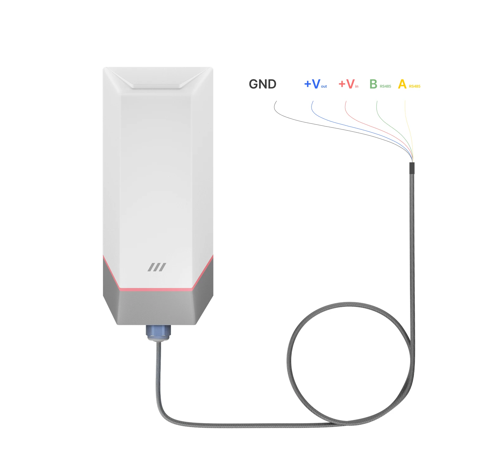
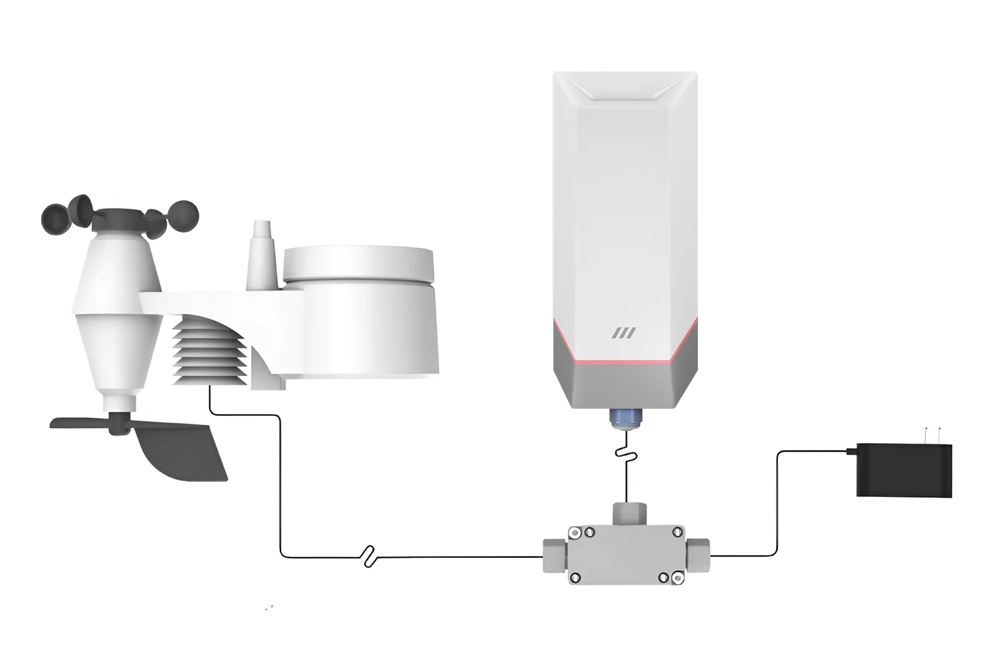

# Power Options in MacSync

## Inbuilt Battery
MacSync devices, including all Maya sensor nodes (CO2, temperature, humidity, air pressure, light, PM2.5, noise, and advanced soil sensors), are designed to operate directly using the **built-in battery.**

- To connect RS485 or analog sensors with the inbuilt battery:
- Follow the wiring specifications provided by your sensor’s manufacturer.
- Ensure power requirements match the MacSync’s supported limits.

## Solar Panel Support
When connecting MacSync to a solar panel or external sensors (e.g., weather stations):
- Use an external junction connector.
- Follow the installation and connection guidelines provided by both MacSync and the sensor manufacturer to ensure safe and reliable operation.

## External Power Supply
MacSync also supports direct external power input (12–24 V DC):
- Ensure wiring is done as per MacSync and the sensor manufacturer’s power and polarity specifications.
- This is ideal for installations where continuous power is available and high-frequency data logging is required.

## Terminal Connections

## Connecting external power 

MacSync can also be powered through a **direct external DC** source within a **12–24 V** range. Ensure proper connection using a compatible terminal or jack, and always refer to both MacSync and sensor manufacturer specifications for safe operation.

### Connecting External Sensors

- **Check Sensor Specifications**  
  Ensure compatibility with MacSync's input requirements.

- **Power Off the device**  
  Turn off MacSync before making any connections.

- **Attach Sensor Cables**  
  Connect cables to the appropriate inputs on MacSync, following the sensor manufacturer’s pin 
configuration and power on device.

- **Configure via Maya App**  
  Power on MacSync and configure it using the Maya app to adjust settings as per your needs.

### Connecting External Power Supply

- **Verify Power Supply**  
  Confirm the power supply matches MacSync's 12-24 V requirement. Turn off both MacSync and the 
power source before connecting.

- **Connect Power Cable , Insure safety**  
  Turn off MacSync before making any connections.

## Led Status

  

    <strong>Blue</strong>
    
Device is connected with Maya app & Flashing Blue - OTA in progress. 

  

  

    <strong>Green</strong>
    
Slow green blink - attempting to connect to the network.

  

  

    <strong>Red blink</strong> 
    
Modifying any confirmed parameters of MacSync.

  

