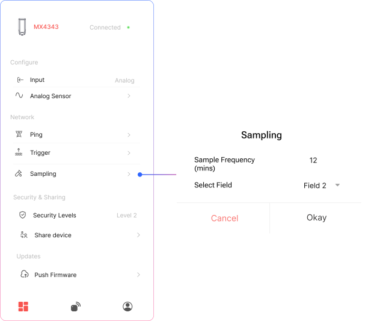

## Data Gathering & Upload Timings

## Data Gathering Frequency

**Sampling** allows the device to collect multiple sensor readings at user-defined intervals **without immediately sending them to the server**.

## How does Gathering & Upload works:
- **Set the sample count** (e.g., 12 samples).
- **Define the time gap** between each sample (e.g., every 5 minutes).
- The device will collect the specified number of samples locally.
- Once all samples are collected, the device will **send a single uplink** containing the aggregated data.

> This helps reduce network usage and power consumption while preserving detailed sensor trends.

