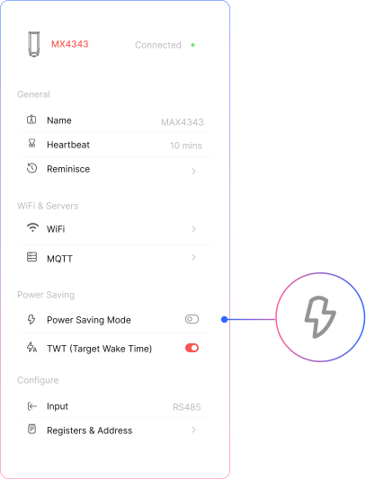

## Power Saving Mode (PSM)

Use the **toggle switch** to enable or disable **Power Saving Mode (PSM)**.

When enabled, MacSync will **enter sleep mode during idle periods** and **wake up only at set intervals** to connect to Wi-Fi and transmit data. This feature helps **extend battery life**, especially in low-traffic deployments.

## Target Wake Time (TWT)

Use the **toggle switch** to enable or disable **Target Wake Time (TWT)**.

When enabled, MacSync and the Wi-Fi access point will n**egotiate a wake-up schedule**, optimizing power usage by reducing the need for constant listening. This is ideal for battery-powered applications where Wi-Fi access points **support TWT (Wi-Fi 6)**.