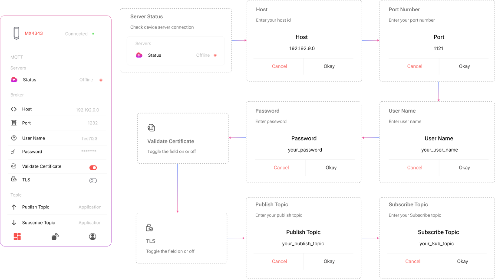

## MQTT Configuration

Configure your MQTT server connection by filling in the following fields:

## Connection Details  
- **Host**: Enter the MQTT broker host (e.g., `mqtt.example.com`).  
- **Port**: Enter the port number (commonly `1883` for non-TLS, `8883` for TLS).  
- **TLS**:  
  Use the toggle to enable or disable **TLS encryption** for secure communication.  
- **Validate Certificate**:  
  Toggle to enable or disable server certificate validation.

## Authentication  
- **Username**: Enter your MQTT broker username.  
- **Password**: Enter the associated password.  

## Topics  
- **Publish Topic**: Enter the topic name where MacSync will send uplink data  
  _(e.g., `macsync/data`)_.  
- **Subscribe Topic**: Enter the topic to receive downlink messages from the server.

## Connection Status  
- A real-time status indicator shows whether the device is connected and actively sending data to the MQTT broker.