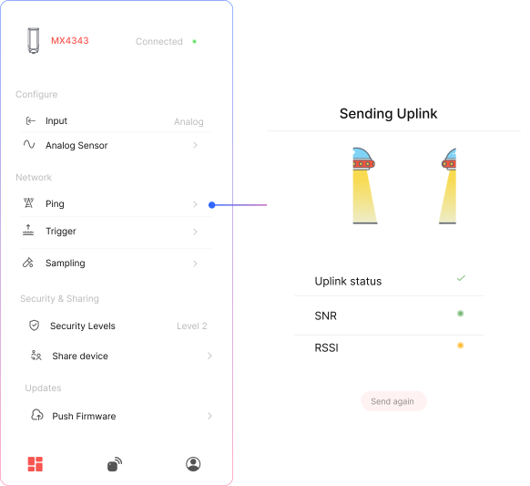

## Wi-Fi Signal Strength Test

When you press **Send Uplink**, the device performs:

- A **network connectivity check**
- A **Wi-Fi signal strength analysis**
- Sends a **data packet** to the configured MQTT server
- The device sends a **confirmed uplink** to the server and **waits for an acknowledgment** to verify connectivity.

## Uplink Status

✅  **Successful Uplink** – Device successfully connected and transmitted data to the server  
❌  **Failed Uplink** – Unable to reach the server or transmit data

## SNR – Signal-to-Noise Ratio

Measures Wi-Fi signal clarity.

- **Excellent:** `> 40 dB`  
- **Good:** `25 to 40 dB`  
- **Fair:** `10 to 25 dB`  
- **Poor:** `< 10 dB`

> **Note:** Higher SNR = cleaner and more reliable signal

## RSSI – Received Signal Strength Indicator

Measures Wi-Fi signal power in dBm (typically negative):

- **Excellent:** `-30 to -50 dBm`  
- **Good:** `-51 to -65 dBm`  
- **Fair:** `-66 to -75 dBm`  
- **Weak:** `-76 to -90 dBm`  
- **Very Weak:** `< -90 dBm`

> **Note:** Closer to 0 = stronger signal