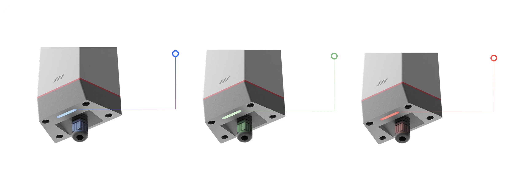

# Power Options - MacSync-L-Power

## External Power Supply
MacSync can also be powered through a **direct external DC** source within a **12–24 V** range. Ensure proper connection using a compatible terminal or jack, and always refer to both MacSync & sensor manufacturer specifications for safe operation.

## Terminal Connections

## Connecting external power 

MacSync can also be powered through a **direct external DC** source within a **12–24 V** range. Ensure proper connection using a compatible terminal or jack, and always refer to both MacSync and sensor manufacturer specifications for safe operation.

## Terminal Connections

### Connecting External Sensors

- **Check Sensor Specifications**  
  Ensure compatibility with MacSync's input requirements.

- **Power Off the device**  
  Turn off MacSync before making any connections.

- **Attach Sensor Cables**  
  Connect cables to the appropriate inputs on MacSync, following the sensor manufacturer’s pin 
configuration and power on device.

- **Configure via Maya App**  
  Power on MacSync and configure it using the Maya app to adjust settings as per your needs.

### Connecting External Power Supply

- **Verify Power Supply**  
  Confirm the power supply matches MacSync's 12-24 V requirement. Turn off both MacSync and the 
power source before connecting.

- **Connect Power Cable , Insure safety**  
  Turn off MacSync before making any connections.

## Led Status

  

    <strong>Blue</strong>
    
Device is connected with Maya app & Flashing Blue - OTA in progress. 

  

  

    <strong>Green</strong>
    
Slow green blink - attempting to connect to the LoRaWAN network.

  

  

    <strong>Red blink</strong> 
    
Modifying any confirmed parameters of MacSync.

  

### 📺 Watch the Setup Video

<iframe
  width="100%"
  height="400"
  src="https://www.youtube.com/embed/UYpAMvrNRSQ"
  frameBorder="0"
  allow="accelerometer; autoplay; clipboard-write; encrypted-media; gyroscope; picture-in-picture"
  allowFullScreen
></iframe>