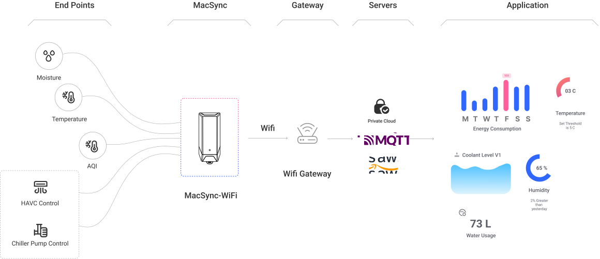

# Product Overview

## Introduction

**MacSync Low Power Wi-Fi RS485/Analog Datalogger** by Macnman Technologies is a compact and energy-efficient IoT data logger designed for industrial, agricultural, and remote monitoring applications. It supports **RS485, analog, and digital sensors**, offering real-time data acquisition over Wi-Fi using MQTT or HTTP protocols.

Configuration is quick and user-friendly using the [**Macnman Maya App**](https://play.google.com/store/apps/details?id=com.macnman.app&pcampaignid=web_share), which leverages Bluetooth Low Energy (BLE). Through the app, users can set parameters, adjust logging intervals, and manage data settings directly from their smartphone—no technical expertise required.

MacSync Wi-Fi ensures seamless data integration, cloud compatibility, and reliable sensor communication—perfect for smart infrastructure, utility systems, and field-level automation.

With its rugged design, flexible sensor support, and intelligent wireless configuration, MacSync is built for professionals who need dependable data logging in the field, on the shop floor, or in remote environments.

## Product Architecture
 

## Core Features

  

    <strong>Multi-Sensor Compatibility</strong>
    
Supports CO₂, temperature, humidity, air pressure, PM2.5, noise, light, and advanced soil sensors for broad environmental monitoring.

  

  

    <strong>Universal Sensor Integration</strong>
    
Works with RS485 and analog sensors (4–20 mA / 0–10 V), allowing seamless integration with legacy systems across industries.

  

  

    <strong>High-Performance Processing</strong>
    
Powered by nRF7002 and nRF53 series SoC for fast, efficient data processing and reliable Wi-Fi connectivity.

  

  

    <strong>Advanced Wi-Fi Connectivity</strong>
    
Supports Wi-Fi 5 and 6 for high-speed, low-latency transmission ideal for real-time IoT operations.

  

  

    <strong>Extended Onboard Storage</strong>
    
Stores up to 3 years of data for long-term logging, even without constant network access.

  

  

    <strong>Rugged & Reliable</strong>
    
Built tough to perform in extreme industrial and environmental conditions.

  

  

    <strong>User-Friendly Interface</strong>
    
Configure effortlessly using the BLE-powered Macnman Maya App with a simple, intuitive UI.

  

## MacSync Dataloggers WiFi Variants

<table className="parameter-table">
  <thead>
    <tr>
      <th>Variant Name</th>
      <th>Power Source</th>
      <th>Battery Capacity</th>
      <th>Solar Support</th>
      <th>External Flash</th>
      <th>RS485/Analog</th>
      <th>Ideal For</th>
    </tr>
  </thead>
  <tbody>
    <tr>
      <td>MacSync Power Operated</td>
      <td>12-24 V (Power)</td>
      <td>✖️</td>
      <td>✖️</td>
      <td>✔️</td>
      <td>✔️</td>
      <td>Industrial or commercial sites with stable power</td>
    </tr>
    <tr>
      <td>MacSync Battery Operated</td>
      <td>Battery</td>
      <td>19 Ah</td>
      <td>✖️</td>
      <td>✔️</td>
      <td>✔️</td>
      <td>Remote or portable deployments with low power</td>
    </tr>
    <tr>
      <td>MacSync Solar + Battery</td>
      <td>Solar + Battery</td>
      <td>Configurable</td>
      <td>✔️</td>
      <td>✔️</td>
      <td>✔️</td>
      <td>Outdoor, off-grid, and energy-autonomous environments</td>
    </tr>
  </tbody>
</table>

## Applications

 - **Industrial Automation**  
   Leverage Wi-Fi-enabled real-time monitoring to control machines, streamline production, and ensure operational safety in factories and industrial setups.

 - **Environmental Monitoring**  
   Use wireless sensors to monitor air quality, humidity, temperature, and soil metrics—ideal for smart farming, sustainability research, and remote data collection.

 - **Smart Buildings**  
   Integrate Wi-Fi-based sensing to monitor HVAC systems, lighting, and air quality for intelligent automation and energy-efficient building management.

 - **Safety & Security**  
   Deploy Wi-Fi-connected detectors for gas leaks, intrusions, or unsafe conditions, enabling instant alerts and proactive safety measures in critical zones.

## Ideal For

- **Businesses**  
  Implement IoT-driven solutions to streamline operations, reduce costs, and improve real-time decision-making.

- **Researchers**  
  Collect precise environmental and scientific data using reliable, field-ready sensing and logging tools.

- **Facility Managers**  
  Enhance building performance with intelligent monitoring of energy use, air quality, and equipment status.

## Why do you need this user manual ?

Following are the several reasons you need this manual.

- **Effective Product Utilization** 

- **Troubleshooting Assistance** 

- **Maintenance & Care** 

- **Warranty & Service Information** 

- **Regulatory Compliance** 

- **Enhanced User Experience** 

- **Resource for Training** 

## Key Parameter Definitions

Below are key technical terms and identifiers relevant for configuring and operating your MacSync device:

<table className="parameter-table">
  <thead>
    <tr>
      <th>Parameter</th>
      <th>Description</th>
    </tr>
  </thead>
  <tbody>
    <tr>
      <td>Wi-Fi Standards</td>
      <td>Defines the protocol versions (e.g., Wi-Fi 5, Wi-Fi 6) that impact speed, range, and efficiency of the wireless connection.</td>
    </tr>
    <tr>
      <td>SSID</td>
      <td>The unique name of a Wi-Fi network that the device connects to for data transmission.</td>
    </tr>
    <tr>
      <td>MAC Address</td>
      <td>Hardware identifier used for Wi-Fi communication, unique to each MacSync device.</td>
    </tr>
    <tr>
      <td>MQTT</td>
      <td>A lightweight messaging protocol optimized for low-bandwidth, high-latency networks commonly used in IoT deployments.</td>
    </tr>
    <tr>
      <td>HTTP</td>
      <td>Standard communication protocol for web-based applications; used for uploading sensor data to cloud dashboards.</td>
    </tr>
    <tr>
      <td>RSSI</td>
      <td>Received Signal Strength Indicator – helps assess the Wi-Fi signal quality received by the device.</td>
    </tr>
    <tr>
      <td>Device Code</td>
      <td>Printed on the product label, used for device registration, binding, and API-based integrations.</td>
    </tr>
    <tr>
      <td>Cloud Platforms</td>
      <td>Supports integration with private and public IoT platforms like AWS IoT, Azure IoT, ThingSpeak, and custom MQTT brokers.</td>
    </tr>
  </tbody>
</table>
