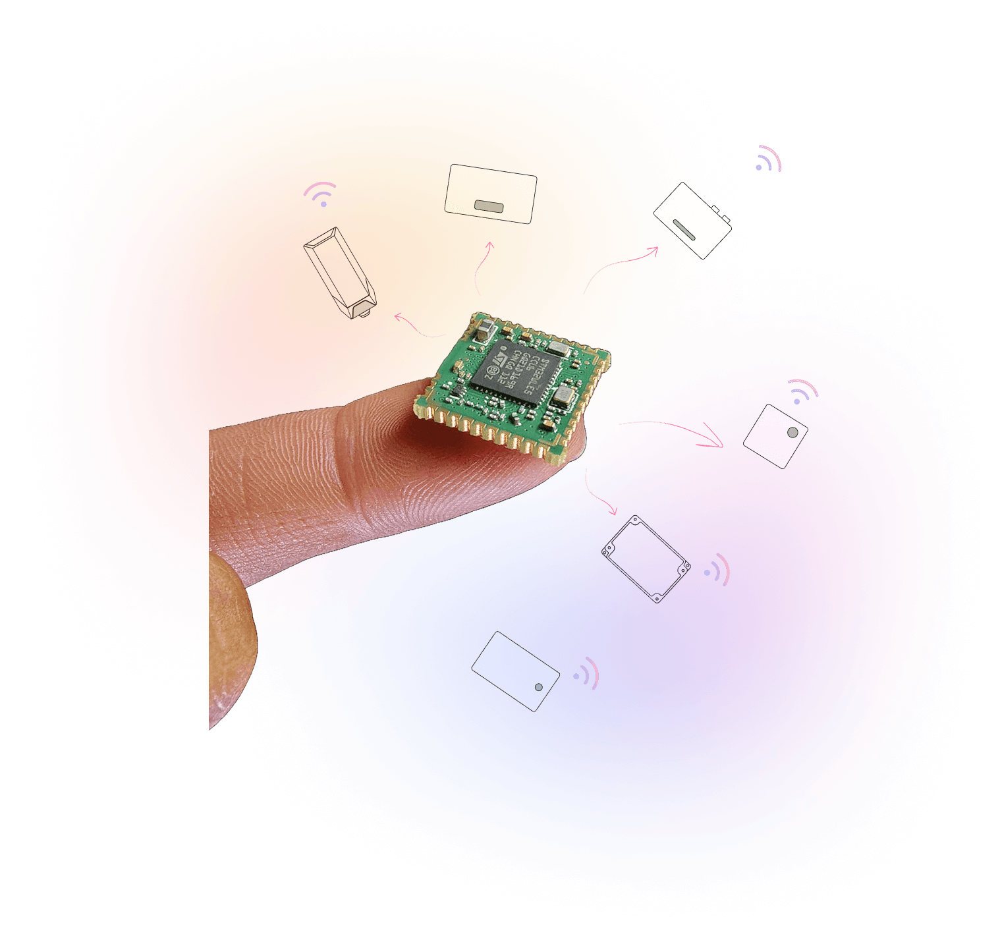

# Overview

## MAC32WLE5 LoRa Module

The **MAC32WLE5** LoRa module by Macnman Technologies Pvt Ltd is a compact, ultra-low-power wireless communication solution built around the robust **STM32WL** Series microcontroller. Tailored for long-range, low-power IoT applications, this module is designed to simplify deployment while maximizing range and energy efficiency.

Powered by a high-performance sub-GHz radio transceiver & a built-in LoRaWAN protocol stack, the MAC32WLE5 **delivers secure, reliable, and scalable connectivity** across wide-area networks. Its flexible RF performance and minimal power consumption make it an ideal choice for battery-operated devices in remote or challenging environments.

From smart agriculture and utility metering to infrastructure monitoring & industrial automation, the MAC32WLE5 is engineered to help developers build **future-ready IoT devices** with ease, efficiency, & confidence.

## Core Features

- **Integrated MCU**  
  Built-in microcontroller unit for seamless embedded processing.

- **Developer-Ready SDK**  
  Complete software development kit support for faster prototyping and integration.

- **Dual-Core Architecture***  
  High-performance dual-core design for multitasking and efficiency.

- **5-Year Battery Life***  
  Optimized for ultra-low power applications—up to 5 years of runtime.

- **LoRa Connectivity**  
  Long-range wireless communication with industry-standard LoRa technology.

- **Rugged Build**  
  Designed for harsh environments — durable, reliable, and industrial-ready.

- **Compact Size**  
  Ultra-small footprint for space-constrained applications.

- **Ultra Low Power (ULP)**  
  Minimal power consumption without compromising performance.

## MAC32WLE5 Module Resources

  <a href="https://github.com/MacnMan/LoRa_Module_SDK/tree/main/Datasheets" 
  className="icon-card">
    
📂
  
    

      <strong>Download Datasheet</strong>
      
Detailed specs including pinouts,hardware specs, & certifications.
.

    

  </a>
  <a href="https://github.com/MacnMan/LoRa_Module_SDK/tree/main/SDK/LoRaWAN_AT_Slave" 
  className="icon-card">
    
📝

    

      <strong>SDK & Sample Code</strong>
      
SDK with libraries and ready-to-use code samples.

    

  </a>
  <a href="https://github.com/MacnMan/LoRa_Module_SDK/tree/main/3D_Model" className="icon-card">
    
📐

    

      <strong>CAD Models</strong>
      
Download 3D files for enclosures and PCB fitting.

    

  </a>
   <a href="https://github.com/MacnMan/LoRa_Module_SDK/tree/main" className="icon-card">
    
📦

    

      <strong>GitHub Repository</strong>
      
Access full source code, releases, and contribute to the project.

    

  </a>

> Need help? Reach out at [support@macnman.com](mailto:support@macnman.com) or raise an issue in our [GitHub repo](https://github.com/MacnMan/LoRa_Module_SDK).

