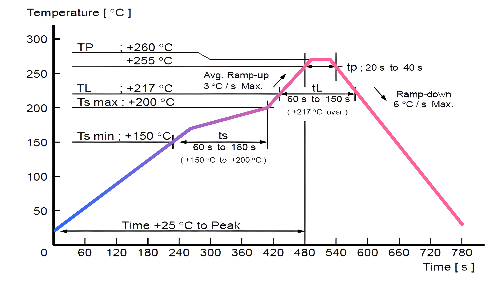

## Reflow & Soldering

Perform SMT following the specified reflow oven temperature profile, ensuring the maximum temperature does not exceed **260°C**.

Adhere to the IPC/JEDEC standards for soldering processes, with a peak temperature maintained below **260°C**.

Limit the reflow soldering process to **≤2 times**, with a strong recommendation to perform only one reflow soldering on the module surface to avoid affecting double-pad SMT areas.

**Steel Mesh Recommendation** Use a 0.2mm thickness partial ladder steel mesh for module SMT. Extend the opening by 0.8mm for optimal solder paste application.

Storage After Unsealing If the module is not fully used after unsealing, vacuum-seal it for storage to prevent exposure to air, which may cause moisture absorption and solder pad oxidation. For intervals of 7 to 30 days before SMT, bake the module **at 65-70°C for 24 hours** without removing the tape.

**ESD Protection Implement** ESD protection measures before handling or using the module for SMT to safeguard against static damage.

For specialized requirements or unique processes, please contact us for further guidance and support.

## Recommended Baking Conditions

- **High-Temperature Baking**  
  Bake at 120°C ± 5°C for 8 hours (1 cycle). Ensure products are baked individually on heat-resistant trays, as
  packaging materials (base tape, reel tape, and cover tape) may deform at this temperature.

- **Moderate-Temperature Baking**  
  Bake at 90°C +8/-0°C for 24 hours (1 cycle). The base tape can be baked together with the product at this
  temperature, but ensure uniform heat distribution during the process.

## Handling Precautions

- **Avoid Mechanical Stress**  
  Exercise caution during handling and transportation to prevent excessive stress or mechanical shocks, as these can
  damage the product.

- **Inspect for Damage**  
  Handle products carefully to avoid cracks or damage to terminals. Any such damage may alter the product’s
  performance and characteristics

- **Prevent Contamination**  
  Avoid direct contact with the product using bare hands, as this can compromise solderability and introduce
  contaminants.

- **ESD Protection**  
  Protect the product from static electrical discharge by using appropriate anti-static measures, such as wrist straps,
  gloves, and anti-static mats.