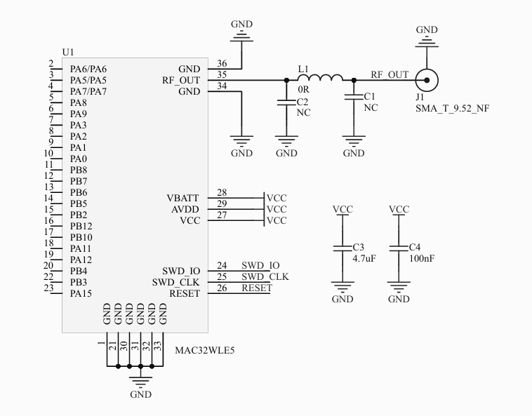
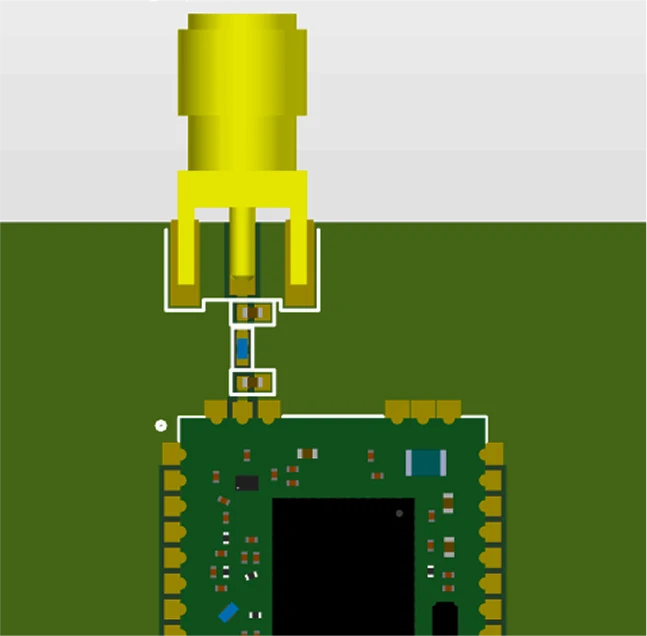

## Reference Schematic: MAC32WBLE5

This is the official recommended schematic for the MAC32WLE5 module, designed for LoRa and BLE applications. It includes essential components for power, RF output, and programming interface to help you integrate the module seamlessly into your design.

#### Key Highlights

- **RF Output Section**
  - `RF_OUT` from the module is connected via a 0Ω jumper (L1) to an external antenna using an SMA connector (`J1`).
  - Capacitors `C1` and `C2` are marked as NC (Not Connected) but can be used for matching or filtering based on layout.
  - Keep trace length short and impedance matched (50Ω) for optimal performance.

- **Power Supply**
  - `VBATT`, `AVDD`, and `VCC` pins are all connected to a stable 3.3V source.
  - Decoupling capacitors `C3` (4.7µF) and `C4` (100nF) are placed near the power pins for stability.

- **Programming & Debugging**
  - `SWD_IO`, `SWD_CLK`, & `RESET` are broken out for easy programming and firmware updates.
  - Standard SWD-compatible debuggers (ST-Link) can be used.

- **Grounding**
  - Proper grounding is maintained with multiple GND pins and stitching vias (recommended in layout).
  - Ensure solid ground plane beneath the module and RF trace to reduce EMI and signal loss.

**Tip:** For best RF results, use a 4-layer PCB with a continuous ground plane and maintain adequate clearance from high-speed or noisy digital signals.

**Note:** Schematic alone does not guarantee RF performance. Follow our PCB layout guidelines for trace width, antenna clearance, and ground stitching to match the reference performance.
## Recommended Antenna Design

To ensure optimal performance and reliable wireless communication, we recommend the following antenna design specifically tested with our module. This antenna setup offers a balanced trade-off between range, efficiency, and ease of integration.

## General Notes for Maximum Performance
- **Antenna Clearance**  
  Ensure the module’s u.FL connector and external antenna area are completely free from obstructions, especially metallic components or enclosures, as these can significantly degrade antenna performance.

- **External Copper Coverage**  
  Apply a copper shield around the PCB, excluding the antenna area, to minimize interference from high-frequency signals, signal cables, and disturbances from other components.

- **Clearance Area**  
  Maintain a clearance zone of at least 4 square centimeters around the antenna area, including any enclosure, to reduce performance degradation caused by proximity to materials or circuits.

- **Grounding**  
  Ensure proper grounding of the device and the module. A solid ground plane should be placed beneath the module to reduce parasitic inductance and improve overall stability.

- **Avoid Copper Under Antenna**  
  Do not place copper, traces, or ground planes directly under the module’s antenna path or near the external antenna connector to prevent signal interference or radiation inefficiencies.

- **Distance from Other Circuits**  
  Position the module’s antenna at least 15 mm away from high-speed signals, power circuits, or noisy components to preserve radiation efficiency and avoid interference.

- **Placement**  
  Place the MAC32WLE5 module near the edge of the PCB, with the u.FL connector facing outward to minimize interference and ensure the external antenna can radiate freely.  
  Keep the module away from dense circuitry to enhance RF performance.

- **Power Supply Isolation**  
  Use magnetic beads and low-ESR capacitors to insulate and filter the power supply to the module, ensuring clean and stable voltage delivery. This reduces noise interference and enhances overall stability.

