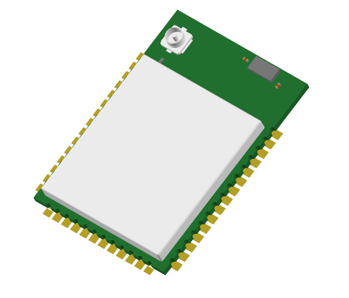

# Overview

## MAC32WBLE5 LoRa Module

The **MAC32WBLE5** is a compact, ultra-low-power wireless module that combines the long-range communication of LoRaWAN with the short-range versatility of Bluetooth Low Energy (BLE), enabling seamless hybrid connectivity for next-generation IoT devices. Developed by Macnman Technologies Pvt Ltd, this module integrates two best-in-class MCUs: the **STM32WL** series for LoRa and the Nordic **nRF52** series for BLE.

This dual-core architecture allows simultaneous operation of LoRa and BLE, unlocking unique capabilities such as long-range data transmission to the cloud and local device provisioning or diagnostics via smartphone or tablet. The MAC32WBLE5 comes with a pre-certified LoRaWAN® protocol stack and supports BLE 5.0, making it ideal for secure, scalable, and energy-efficient applications.

With its small footprint, robust RF performance, and ultra-low power design, the MAC32WBLE5 is perfectly suited for battery-powered devices operating in remote or challenging environments.

## Core Features

- **Dual MCU Architecture**  
  Combines STM32WL for LoRa and nRF52 for BLE for optimized hybrid communication.

- **LoRaWAN® + BLE 5.0 Support**  
  Enables long-range transmission and local provisioning or configuration via smartphone.

- **Ultra Low Power Consumption**  
  Ideal for battery-operated devices with multi-year battery life capability.

- **Developer-Ready SDKs**  
  Supports STM32Cube and Nordic SDKs for rapid development and customization.

- **Compact & Industrial-Ready Design**  
  Small footprint and rugged build suitable for embedded and outdoor applications.

- **Pre-Certified Protocol Stacks**  
  Integrated and tested stacks for faster deployment and reduced certification effort.

- **Over-the-Air Updates**  
  BLE-enabled OTA firmware updates for in-field upgrades and diagnostics.

- **Secure & Reliable Communication**  
  AES-128 encryption, CRC checks, and robust radio link design for critical IoT applications.

## MAC32WBLE5 Module Resources

  <a href="https://github.com/MacnMan/LoRa_BLE_Module_SDK/tree/main/3D_Model" 
  className="icon-card">
    
📂
  
    

      <strong>Download Datasheet</strong>
      
Detailed specs including pinouts,hardware specs, & certifications.
.

    

  </a>
  <a href="https://github.com/MacnMan/LoRa_BLE_Module_SDK/tree/main/SDK" 
  className="icon-card">
    
📝

    

      <strong>SDK & Sample Code</strong>
      
SDK with libraries and ready-to-use code samples.

    

  </a>
  <a href="https://github.com/MacnMan/LoRa_BLE_Module_SDK/tree/main/3D_Model" className="icon-card">
    
📐

    

      <strong>CAD Models</strong>
      
Download 3D files for enclosures and PCB fitting.

    

  </a>
   <a href="https://github.com/MacnMan/LoRa_BLE_Module_SDK/tree/main" className="icon-card">
    
📦

    

      <strong>GitHub Repository</strong>
      
Access full source code, releases, and contribute to the project.

    

  </a>

# Key Parameters

- **LoRaWAN® Protocol Support**  
  Operates on global license-free ISM bands: `IN865`, `US915`, `EU868`, `AU915`.

- **LoRa Point-to-Point (P2P) Communication**  
  Direct sensor-to-controller communication without gateways, ideal for custom mesh and star networks.

- **Bluetooth Low Energy (BLE) 5.0**  
  Powered by Nordic nRF52 series, enables seamless device provisioning, in-field configuration, OTA firmware updates, and local diagnostics.

- **Dual-MCU Architecture**  
  LoRa handled by STM32WL; BLE managed by Nordic nRF52 — optimized for hybrid use cases and parallel radio operation.

- **RF Output Power**  
  Up to +22 dBm (LoRa) with high-efficiency PA, suitable for long-range outdoor deployment.

- **Receiver Sensitivity**  
  As low as -148 dBm (LoRa) for highly reliable data reception in noisy environments.

- **Communication Range**  
  Up to 8+ km line-of-sight in rural or semi-urban areas under ideal conditions.

- **Power Consumption**  
  Sleep current < 3 µA. Active current optimized for both BLE and LoRa to enable multi-year operation on batteries.

- **Multi-Modulation Support**  
  Supports LoRa®, (G)FSK, and OOK modulations. BLE supports 1M/2M PHY for fast local communication.

- **Security**  
  AES-128 encryption for LoRa; BLE Secure Connections with LE Privacy for trusted local connectivity.

- **Operating Temperature Range**  
  -40°C to +85°C — designed for industrial and harsh environment deployments.

> Need help? Reach out at [support@macnman.com](mailto:support@macnman.com) or raise an issue in our [GitHub repo](https://github.com/MacnMan/LoRa_Module_SDK).

