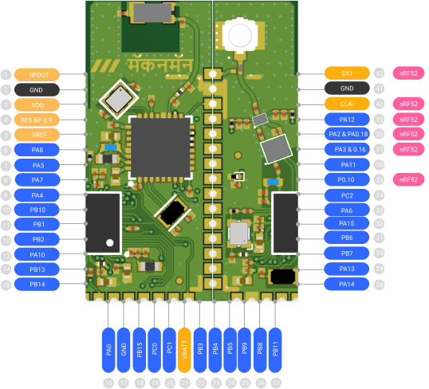

## Pin Description

## Pin definition

| No. | Pin Name     | Type   | Functions / Notes                                                                                                      | Extra Info                                       |
|-----|--------------|--------|------------------------------------------------------------------------------------------------------------------------|--------------------------------------------------|
| 1   | ANTEX        | RF     | RF INPUT/OUTPUT                                                                                                        |                                                  |
| 2   | VSS/GND      | POWER  |                                                                                                                        |                                                  |
| 3   | VCC          | POWER  |                                                                                                                        |                                                  |
| 4   | NRST/P0.09   | I/O    | Need To be Pulled Up by nRF52                                                                                          | Internally Connected to nRF52810 P0.09           |
| 5   | VDDA/VREF+   | POWER  |                                                                                                                        |                                                  |
| 6   | PA8          | I/O    | MCO, TIM1_CH1, SPI2_SCK/I2S2_CK, USART1_CK, LPTIM2_OUT, CM4_EVENTOUT                                                   |                                                  |
| 7   | PA5          | I/O    | TIM2_CH1, TIM2_ETR, SPI2_MISO, SPI1_SCK, DEBUG_SUBGHZSPI_SCKOUT, LPTIM2_ETR, CM4_EVENTOUT                              |                                                  |
| 8   | PA7          | I/O    | TIM1_CH1N, I2C3_SCL, SPI1_MOSI, COMP2_OUT, DEBUG_SUBGHZSPI_MOSIOUT, TIM17_CH1, CM4_EVENTOUT                            |                                                  |
| 9   | PA4          | I/O    | RTC_OUT2, LPTIM1_OUT, SPI1_NSS, USART2_CK, DEBUG_SUBGHZSPI_NSSOUT, LPTIM2_OUT, CM4_EVENTOUT                            |                                                  |
| 10  | PB10         | I/O    | TIM2_CH3, I2C3_SCL, SPI2_SCK/I2S2_CK, LPUART1_RX, COMP1_OUT, CM4_EVENTOUT                                              |                                                  |
| 11  | PB1          | I/O    | LPUART1_RTS_DE, LPTIM2_IN1, CM4_EVENTOUT                                                                               |                                                  |
| 12  | PB2          | I/O    | LPTIM1_OUT, I2C3_SMBA, SPI1_NSS, DEBUG_RF_SMPSRDY, CM4_EVENTOUT                                                        |                                                  |
| 13  | PA10         | I/O    | RTC_REFIN, TIM1_CH3, I2C1_SDA, SPI2_MOSI/I2S2_SD, USART1_RX, DEBUG_RF_HSE32RDY, TIM17_BKIN, CM4_EVENTOUT               |                                                  |
| 14  | PB13         | I/O    | TIM1_CH1N, I2C3_SCL, SPI2_SCK/I2S2_CK, LPUART1_CTS, CM4_EVENTOUT                                                        | ADC_IN0                                          |
| 15  | PB14         | I/O    | TIM1_CH2N, I2S2_MCK, I2C3_SDA, SPI2_MISO, CM4_EVENTOUT                                                                 |                                                  |
| 16  | PA0          | I/O    | TIM2_CH1, I2C3_SMBA, I2S_CKIN, USART2_CTS, COMP1_OUT, DEBUG_PWR_REGLP1S, TIM2_ETR, CM4_EVENTOUT                        | TAMP_IN2/WKUP1                                   |
| 17  | VSS/GND      | POWER  | -                                                                                                                      |                                                  |
| 18  | PB15         | I/O    | TIM1_CH3N, I2C2_SCL, SPI2_MOSI/I2S2_SD, CM4_EVENTOUT                                                                   |                                                  |
| 19  | PC0          | I/O    | LPTIM1_IN1, I2C3_SCL, LPUART1_RX, LPTIM2_IN1, CM4_EVENTOUT                                                              |                                                  |
| 20  | PC1          | I/O    | LPTIM1_OUT, SPI2_MOSI/I2S2_SD, I2C3_SDA, LPUART1_TX, CM4_EVENTOUT                                                       |                                                  |
| 21  | VBATT        | POWER  | -                                                                                                                      |                                                  |
| 22  | PB3          | I/O    | JTDO/TRACESWO, TIM2_CH2, SPI1_SCK, RF_IRQ0, USART1_RTS, DEBUG_RF_DTB1, CM4_EVENTOUT                                     |                                                  |
| 23  | PB4          | I/O    | NJTRST, I2C3_SDA, SPI1_MISO, USART1_CTS, DEBUG_RF_LDORDY, TIM17_BKIN, CM4_EVENTOUT                                     |                                                  |
| 24  | PB5          | I/O    | LPTIM1_IN1, I2C1_SMBA, SPI1_MOSI, RF_IRQ1, USART1_CK, COMP2_OUT, TIM16_BKIN, CM4_EVENTOUT                               |                                                  |
| 25  | PB9          | I/O    | TIM1_CH3N, I2C1_SDA, SPI2_NSS/I2S2_WS, IR_OUT, TIM17_CH1, CM4_EVENTOUT                                                  |                                                  |
| 26  | PB8          | I/O    | TIM1_CH2N, I2C1_SCL, RF_IRQ2, TIM16_CH1, CM4_EVENTOUT                                                                   |                                                  |
| 27  | PB11         | I/O    | TIM2_CH4, I2C3_SDA, LPUART1_TX, COMP2_OUT, CM4_EVENTOUT                                                                 |                                                  |
| 28  | PA14         | I/O    | JTCK-SWCLK, LPTIM1_OUT, I2C1_SMBA, CM4_EVENTOUT                                                                         | ADC_IN10                                         |
| 29  | PA13         | I/O    | JTMS-SWDIO, I2C2_SMBA, IR_OUT, CM4_EVENTOUT                                                                             | ADC_IN9                                          |
| 30  | PB7          | I/O    | LPTIM1_IN2, TIM1_BKIN, I2C1_SDA, USART1_RX, TIM17_CH1N, CM4_EVENTOUT                                                    |                                                  |
| 31  | PB6          | I/O    | LPTIM1_ETR, I2C1_SCL, USART1_TX, TIM16_CH1N, CM4_EVENTOUT                                                               |                                                  |
| 32  | PA15         | I/O    | JTDI, TIM2_CH1, TIM2_ETR, I2C2_SDA, SPI1_NSS, CM4_EVENTOUT                                                              |                                                  |
| 33  | PA6          | I/O    | TIM1_BKIN, I2C2_SMBA, SPI1_MISO, LPUART1_CTS, DEBUG_SUBGHZSPI_MISOOUT, TIM16_CH1, CM4_EVENTOUT                         |                                                  |
| 34  | PC2          | I/O    | LPTIM1_IN2, SPI2_MISO, CM4_EVENTOUT                                                                                     |                                                  |
| 35  | P0.10        | I/O    | nRF52810 Pin                                                                                                            |                                                  |
| 36  | PA11         | I/O    | TIM1_CH4, TIM1_BKIN2, LPTIM3_ETR, I2C2_SDA, SPI1_MISO, USART1_CTS, DEBUG_RF_NRESET, CM4_EVENTOUT                       |                                                  |
| 37  | PA3/P0.16    | I/O    | TIM2_CH4, I2S2_MCK, USART2_RX, LPUART1_RX, CM4_EVENTOUT                                                                 | Internally Connected to nRF52810 P0.16           |
| 38  | PA2/P0.18    | I/O    | LSCO, TIM2_CH3, USART2_TX, LPUART1_TX, COMP2_OUT, DEBUG_PWR_LDORDY, CM4_EVENTOUT                                       | LSCO, Internally Connected to nRF52811 P0.18     |
| 39  | PA12         | I/O    | TIM1_ETR, LPTIM3_IN1, I2C2_SCL, SPI1_MOSI, RF_BUSY, USART1_RTS, CM4_EVENTOUT                                            | ADC_IN8                                          |
| 40  | SWDCLK       | I/O    | nRF52810 Pin                                                                                                            |                                                  |
| 41  | VSS/GND      | POWER  | -                                                                                                                      |                                                  |
| 42  | SWDIO        | I/O    | nRF52810 Pin                                                                                                            |                                                  |
| --  | PA1          | I/O    | TIM2_CH2, LPTIM3_OUT,I2C1_SMBA, SPI1_SCK,,USART2_RTS, LPUART1_RTS,DEBUG_PWR_REGLP2S,CM4_EVENTOUT                        | Internally Connected to nRF52810 P0.20           |