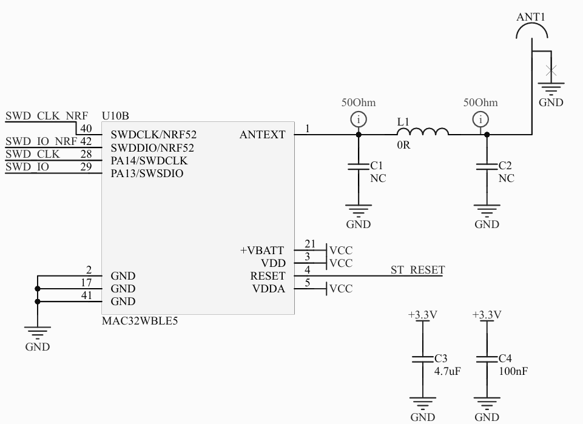
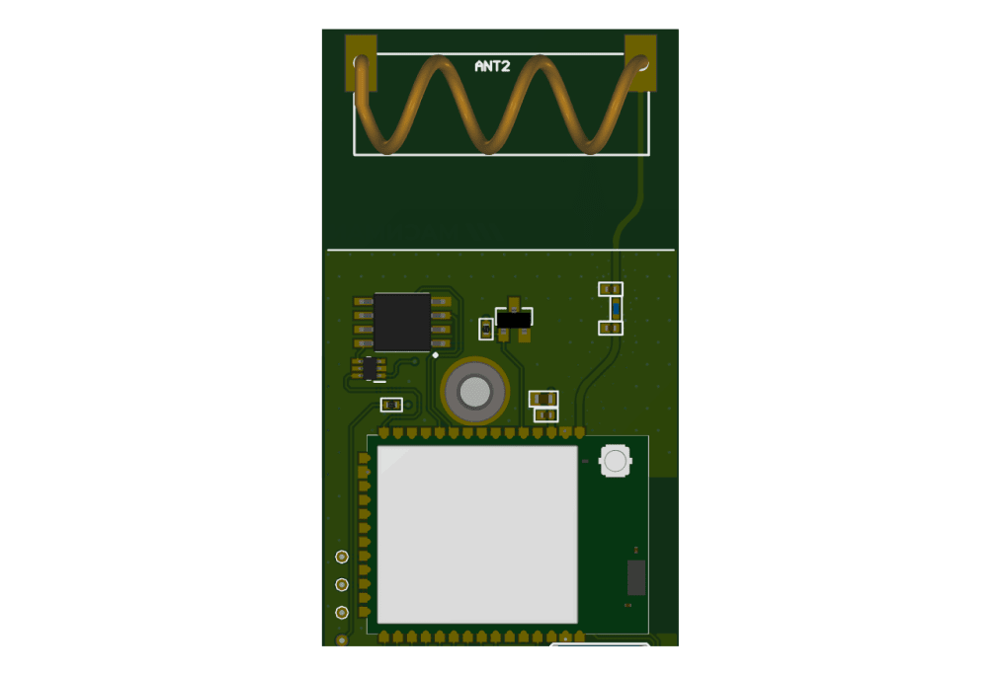

## Reference Schematic: MAC32WBLE5

Below is the validated reference schematic for the MAC32WBLE5 module, combining LoRa and BLE functionality. This schematic showcases the minimum required components for successful operation and RF output, ensuring optimal performance and stability in your end application.

#### Key Design Notes:

- **RF Output Path**  
  - A **0Ω** jumper connects the module’s RF output (`ANTEXT`) directly to the antenna connector.  
  - 50Ω-matched layout is recommended.  
  - Optional capacitor placeholders (C45, C46) allow for fine tuning or matching if needed.

- **Antenna**  
  - Ensure antenna is placed away from noisy components and has proper ground clearance.

- **Power Supply**  
  - Decoupling capacitors C21 (4.7µF) and C22 (100nF) ensure clean supply rails.  
  - Operates from a +3.3V source. VBATT, VDD, and VDDA should be connected to this regulated supply.

- **Programming Interface**  
  - SWD lines (`SWDCLK`, `SWDIO`) are broken out for firmware flashing and debugging.  
  - Compatible with standard ST-Link and J-Link debuggers.

- **Reset Circuit**  
  - A simple reset line is provided. You can connect this to a button or external controller for module reset control.

**Tip:** Maintain short and wide traces for power lines, and follow proper RF layout guidelines to minimize losses and interference.

**Note:** Final performance depends heavily on PCB layout, ground plane integrity, and enclosure design. We strongly recommend following our layout reference files or consulting with an RF engineer during PCB development.

## Recommended Antenna Design

To ensure optimal performance and reliable wireless communication, we recommend the following antenna design specifically tested with our module. This antenna setup offers a balanced trade-off between range, efficiency, and ease of integration.

## Recommmended PCB Layouts

To ensure optimal antenna performance, the module antenna area must remain free of GND planes, metal crosswiring, or nearby components. It is recommended to design a hollow or clear area around the antenna or position the
module along the edge of the PCB.

## Notes for Maximum Performance
- **Antenna Clearance**  
  Ensure the module’s u.FL connector and external antenna area are completely free from obstructions, especially metallic components or enclosures, as these can significantly degrade antenna performance.

- **External Copper Coverage**  
  Apply a copper shield around the PCB, excluding the antenna area, to minimize interference from high-frequency signals, signal cables, and disturbances from other components.

- **Clearance Area**  
  Maintain a clearance zone of at least 4 square centimeters around the antenna area, including any enclosure, to reduce performance degradation caused by proximity to materials or circuits.

- **Grounding**  
  Ensure proper grounding of the device and the module. A solid ground plane should be placed beneath the module to reduce parasitic inductance and improve overall stability.

- **Avoid Copper Under Antenna**  
  Do not place copper, traces, or ground planes directly under the module’s antenna path or near the external antenna connector to prevent signal interference or radiation inefficiencies.

- **Distance from Other Circuits**  
  Position the module’s antenna at least 15 mm away from high-speed signals, power circuits, or noisy components to preserve radiation efficiency and avoid interference.

- **Placement**  
  Place the MAC32WLE5 module near the edge of the PCB, with the u.FL connector facing outward to minimize interference and ensure the external antenna can radiate freely.  
  Keep the module away from dense circuitry to enhance RF performance.

- **Power Supply Isolation**  
  Use magnetic beads and low-ESR capacitors to insulate and filter the power supply to the module, ensuring clean and stable voltage delivery. This reduces noise interference and enhances overall stability.

