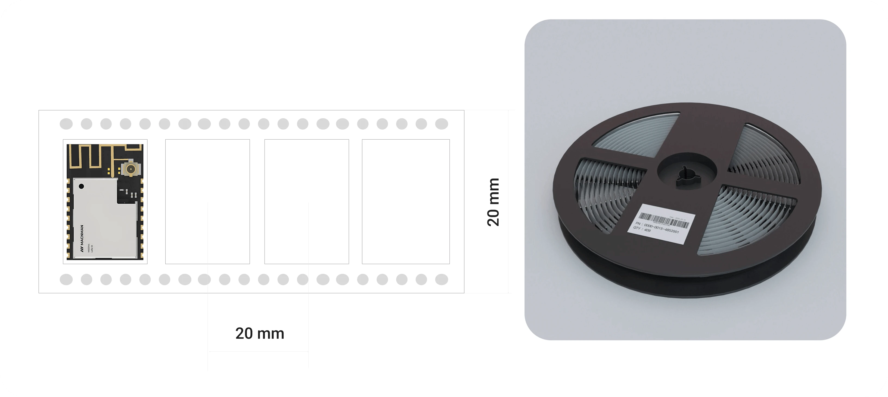
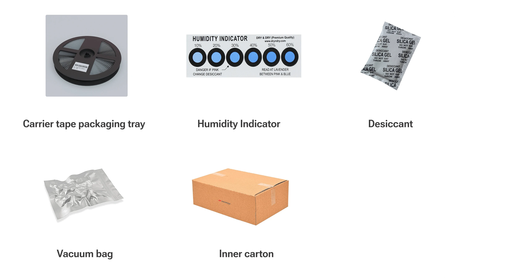

## Reel type Package

## Part List

## Storage Condition
- **Usage Timeline**  
  Please ensure the product is used within 6 months of receipt.

- **Unopened Package Storage**  
  Store the product in its unopened package at an ambient temperature of 5°C to 35°C with a humidity range of 20% to 70%RH.

- **Extended Storage**  
  If the product remains unused for more than 6 months after receipt, it must be inspected and confirmed before use.

- **Non-Corrosive Environment**  
  Store the product in an environment free from corrosive gases, such as Cl₂, NH₃, SO₂, and NOx.

- **Packaging Care**  
  Avoid mechanical shocks or damage to the packaging materials, such as punctures from sharp objects or dropping the product.

- **Moisture Sensitivity Level**  
  This product complies with MSL2 standards (per JEDEC J-STD-020).

  
## Guidelines After Opening the Package

- **Storage After Opening**  
  Once opened, store the product at a temperature of ≤30°C with humidity below 60%RH. Use the product within 3 to 6
months of opening.

- **Indicator Color Change**  
  If the moisture indicator in the package changes color, bake the product before soldering. Baking is not required for
up to 1 year if storage conditions remain below 30°C and 60%RH.

- **Moisture Sensitivity**  
  Refer to MSL2 guidelines for exposure criteria. If the product is exposed to conditions of ≥168h @ 85°C/60%RH or
stored for more than 1 year, baking is recommended.

